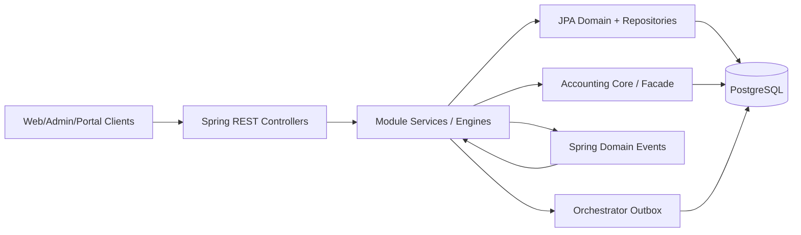
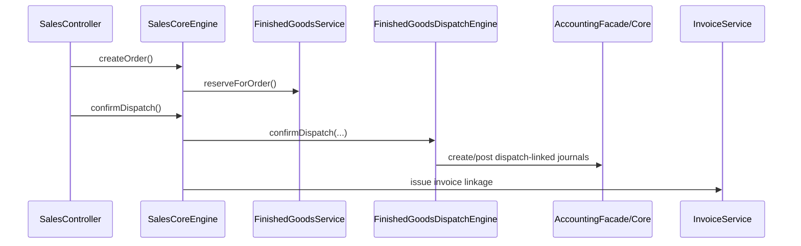
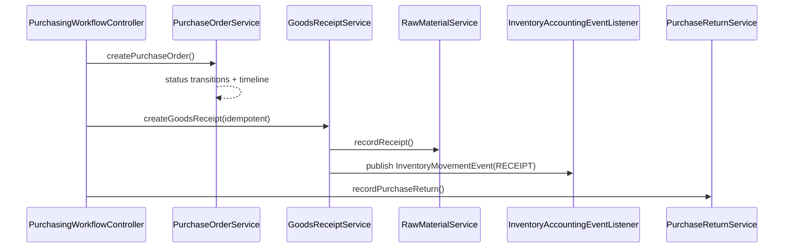
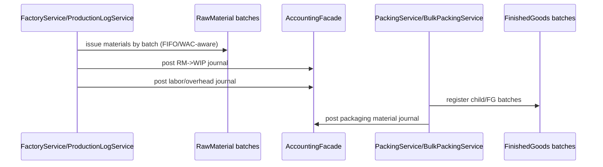
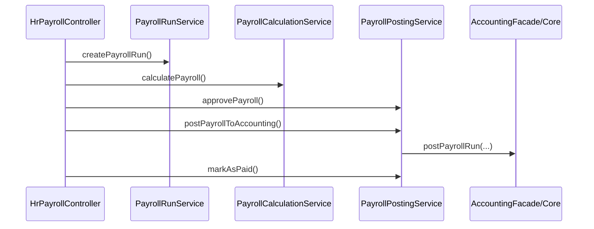
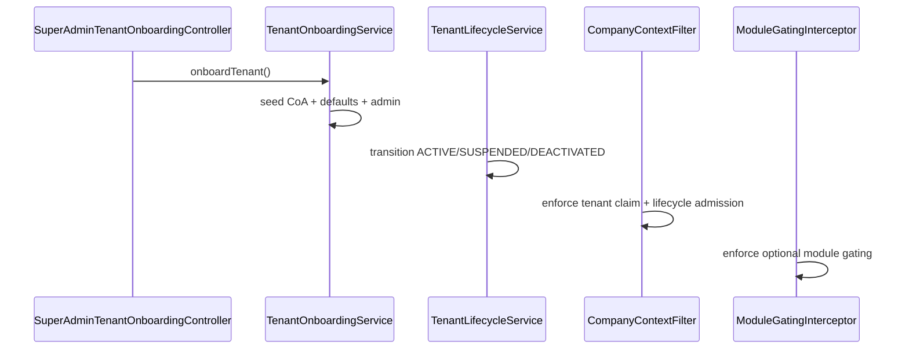
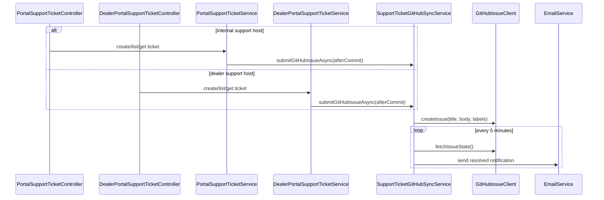
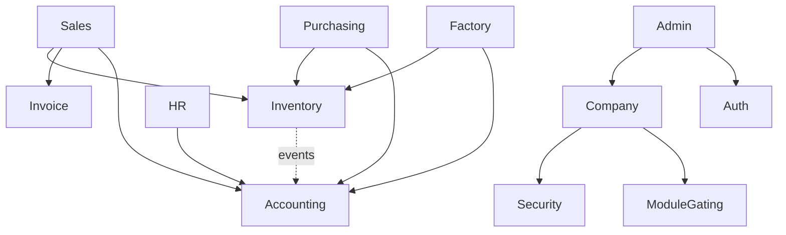

# orchestrator-erp Architecture (Code-Grounded)

Last reviewed: 2026-04-02

This is the canonical runtime architecture reference in the public `orchestrator-erp` docs spine. Use [docs/INDEX.md](INDEX.md) for top-level navigation and [../ARCHITECTURE.md](../ARCHITECTURE.md) only as the repo-root signpost into this packet.

## 1) Runtime topology and module map

### 1.1 System topology

### 1.2 Module inventory and layering

- Modules are organized under `com.bigbrightpaints.erp.modules/*` with module-local `domain`, `service`, `controller`, and DTO packages (`erp-domain/src/main/java/com/bigbrightpaints/erp/modules`).
- Central cross-cutting infrastructure lives in `core/*` (security filters, exceptions, audit, config) and shared orchestrations in `orchestrator/*`.
- Security and tenant runtime admission starts in `CompanyContextFilter` before module code executes (`erp-domain/src/main/java/com/bigbrightpaints/erp/core/security/CompanyContextFilter.java`).
- Optional module access is then enforced by `ModuleGatingInterceptor` + `ModuleGatingService`, while core modules remain always-on (`erp-domain/src/main/java/com/bigbrightpaints/erp/modules/company/service/ModuleGatingInterceptor.java`, `erp-domain/src/main/java/com/bigbrightpaints/erp/modules/company/service/ModuleGatingService.java`, `erp-domain/src/main/java/com/bigbrightpaints/erp/modules/company/domain/CompanyModule.java`).

### 1.3 Cross-module accounting dependency model

Most operational modules post financial effects through accounting facade/core APIs:

- Sales/O2C dispatch + invoicing → accounting postings (`SalesCoreEngine.confirmDispatch`, `InvoiceService.issueInvoiceForOrder`, `AccountingFacade.createStandardJournal`).
- Purchasing/GRN/returns → inventory movements + accounting entries (`GoodsReceiptService`, `PurchaseReturnService`, `InventoryAccountingEventListener`).
- Factory/production/packing → WIP/consumption/value journals (`ProductionLogService`, `PackingService`, `BulkPackingService`).
- Payroll run posting/payment → payroll journals (`PayrollPostingService`, `AccountingCoreEngineCore.postPayrollRun`).

Canonical seam rule after Wave 3:

- Inject `AccountingFacade`, `AccountingService`, `AccountingPeriodService`, `ReconciliationService`, and `AccountingAuditTrailService` at module boundaries.
- Treat the `*Core` / `*Engine` accounting ladder as internal implementation scaffolding, not as new public service entrypoints.
- Operational finished-good costing stays in `modules.inventory.service.InventoryValuationService`; report and snapshot valuation reads live in `modules.reports.service.InventoryValuationQueryService`.

Key facade entrypoint: `JournalCreationRequest` encapsulates debit/credit lines, source module/reference, and period date semantics (`erp-domain/src/main/java/com/bigbrightpaints/erp/modules/accounting/dto/JournalCreationRequest.java`).

## 2) End-to-end business flow architecture

### 2.1 O2C (Order-to-Cash): order -> reserve -> dispatch -> invoice -> AR

Evidence and invariants:

- Order creation uses idempotency key + payload signature replay semantics (`SalesController.createOrder`, `SalesCoreEngine.createOrder`, `resolveExistingOrder`).
- Reservation allocates by configured costing selection methods and records reservation movements (`FinishedGoodsReservationEngine.reserveForOrder`, `selectBatchesByCostingMethod`, `InventoryMovementRecorder.recordFinishedGoodMovement`).
- Dispatch confirmation enforces slip/order linkage consistency, disallows invalid statuses, applies override guardrails, and reconciles existing financial markers on replay (`SalesCoreEngine.confirmDispatch`).
- Slip-level dispatch decrements `currentStock`/`reservedStock`, updates reservation fulfillment, writes movement records, and creates backorder slips when needed (`FinishedGoodsDispatchEngine.confirmDispatch`, `PackagingSlipService.createBackorderSlip`).
- Invoice issuance requires single-active-slip semantics and delegates dispatch confirmation if needed (`InvoiceService.issueInvoiceForOrder`).

Primary files:

- `erp-domain/src/main/java/com/bigbrightpaints/erp/modules/sales/controller/SalesController.java`
- `erp-domain/src/main/java/com/bigbrightpaints/erp/modules/sales/service/SalesCoreEngine.java`
- `erp-domain/src/main/java/com/bigbrightpaints/erp/modules/inventory/service/FinishedGoodsReservationEngine.java`
- `erp-domain/src/main/java/com/bigbrightpaints/erp/modules/inventory/service/FinishedGoodsDispatchEngine.java`
- `erp-domain/src/main/java/com/bigbrightpaints/erp/modules/invoice/service/InvoiceService.java`

### 2.2 P2P (Procure-to-Pay): PO -> GRN -> inventory/AP -> purchase returns

Evidence and invariants:

- PO lifecycle transitions are explicit and constrained (`PurchaseOrderService.isValidTransition`, `transitionStatus`, timeline history persistence).
- GRN requires `Idempotency-Key`, hashes request payload, verifies replay signatures, locks PO/materials, enforces remaining qty boundaries, and transitions PO status to partial/fully received (`PurchasingWorkflowController.createGoodsReceipt`, `GoodsReceiptService.createGoodsReceipt`).
- Raw material receipt emits inventory movement events for accounting integration when source/destination accounts exist (`GoodsReceiptService.publishInventoryEvents`, `InventoryAccountingEventListener.onInventoryMovement`).
- Purchase returns validate returnable quantity, deduct batch stock FIFO, post accounting return journal, and prevent idempotency payload drift (`PurchaseReturnService.recordPurchaseReturn`, `validateReturnReplay`).

Primary files:

- `erp-domain/src/main/java/com/bigbrightpaints/erp/modules/purchasing/controller/PurchasingWorkflowController.java`
- `erp-domain/src/main/java/com/bigbrightpaints/erp/modules/purchasing/service/PurchaseOrderService.java`
- `erp-domain/src/main/java/com/bigbrightpaints/erp/modules/purchasing/service/GoodsReceiptService.java`
- `erp-domain/src/main/java/com/bigbrightpaints/erp/modules/purchasing/service/PurchaseReturnService.java`
- `erp-domain/src/main/java/com/bigbrightpaints/erp/modules/accounting/event/InventoryAccountingEventListener.java`

### 2.3 M2S (Manufacturing-to-Stock): production issue -> WIP -> packing -> FG batches

Evidence and invariants:

- Production logs consume raw material batches atomically (`deductQuantityIfSufficient`) and persist movement traceability (`ProductionLogService.issueFromBatches`).
- Material issue + labor/overhead journals are posted to WIP/consumption accounts (`ProductionLogService.postMaterialJournal`, `postLaborOverheadJournal`).
- Semi-finished and finished-good batch registration updates stock and movement lines (`ProductionLogService.registerSemiFinishedBatch`, `PackingService.executeLine`, `BulkPackingService.createChildBatches`).
- Packing idempotency uses reserved keys/hash with replay resolution and journal/movement linking helpers (`PackingService.reserveIfNeeded`, `packingJournalLinkHelper.linkPackagingMovementsToJournal`).
- The stock-truth decision for Wave 4 is documented in [`docs/developer/onboarding-stock-readiness/06-stock-truth-decision.md`](./developer/onboarding-stock-readiness/06-stock-truth-decision.md); later packets must treat batch rows as authoritative stock state and aggregate stock fields as derived summaries.

Primary files:

- `erp-domain/src/main/java/com/bigbrightpaints/erp/modules/factory/service/ProductionLogService.java`
- `erp-domain/src/main/java/com/bigbrightpaints/erp/modules/factory/service/PackingService.java`
- `erp-domain/src/main/java/com/bigbrightpaints/erp/modules/factory/service/BulkPackingService.java`
- `erp-domain/src/main/java/com/bigbrightpaints/erp/modules/factory/service/FactoryService.java`

### 2.4 Payroll -> Accounting

Evidence and invariants:

- Payroll run identity/idempotency is period+type keyed with signature checks (`PayrollRunService.createPayrollRun`, `buildIdempotencyKey`, `assertRunSignatureMatches`).
- Calculation derives line-level earnings/deductions from attendance + statutory engines (`PayrollCalculationService.calculatePayroll`, `calculateEmployeePay`).
- Posting enforces required payroll account availability, deduction classification constraints, and posted-status/journal-link invariants (`PayrollPostingService.postPayrollToAccounting`).
- Journal posting path goes through standardized lines into accounting core (`AccountingCoreEngineCore.postPayrollRun` -> `createStandardJournal`).

Primary files:

- `erp-domain/src/main/java/com/bigbrightpaints/erp/modules/hr/controller/HrPayrollController.java`
- `erp-domain/src/main/java/com/bigbrightpaints/erp/modules/hr/service/PayrollRunService.java`
- `erp-domain/src/main/java/com/bigbrightpaints/erp/modules/hr/service/PayrollCalculationService.java`
- `erp-domain/src/main/java/com/bigbrightpaints/erp/modules/hr/service/PayrollPostingService.java`
- `erp-domain/src/main/java/com/bigbrightpaints/erp/modules/accounting/internal/AccountingCoreEngineCore.java`

### 2.5 Tenant onboarding / lifecycle / runtime controls

Evidence and invariants:

- Onboarding seeds company, template accounts, default accounting pointers, first admin, and baseline period/settings (`TenantOnboardingService.onboardTenant`).
- Lifecycle transitions are constrained (`ACTIVE <-> SUSPENDED`, irreversible from `DEACTIVATED`) and audited (`TenantLifecycleService.validateTransition`, `auditTransition`).
- Request-path tenant enforcement blocks claim/header mismatches and enforces lifecycle read-only/deactivated behavior (`CompanyContextFilter`).
- Optional module access is path-mapped and denied with `MODULE_DISABLED` when not enabled (`ModuleGatingInterceptor.resolveTargetModule`, `ModuleGatingService`).

Primary files:

- `erp-domain/src/main/java/com/bigbrightpaints/erp/modules/company/controller/SuperAdminTenantOnboardingController.java`
- `erp-domain/src/main/java/com/bigbrightpaints/erp/modules/company/service/TenantOnboardingService.java`
- `erp-domain/src/main/java/com/bigbrightpaints/erp/modules/company/service/TenantLifecycleService.java`
- `erp-domain/src/main/java/com/bigbrightpaints/erp/core/security/CompanyContextFilter.java`
- `erp-domain/src/main/java/com/bigbrightpaints/erp/modules/company/service/ModuleGatingInterceptor.java`

### 2.6 Data migration/import flows (opening balances, opening stock, Tally XML)

- Opening balances CSV import creates/matches accounts, validates balanced totals, and posts opening journal under deterministic import reference (`OpeningBalanceImportController`, `OpeningBalanceImportService.importOpeningBalances`, `postOpeningBalanceJournal`).
- Tally XML import parses ledgers + opening rows, maps Tally groups to account types, and delegates posting via opening balance service (`TallyImportController`, `TallyImportService.importTallyXml`, `processImport`).
- Opening stock import ingests RM/FG batches, increments inventory, and posts aggregate opening stock journal with idempotency by key/hash (`OpeningStockImportController`, `OpeningStockImportService.importOpeningStock`).

Primary files:

- `erp-domain/src/main/java/com/bigbrightpaints/erp/modules/accounting/controller/OpeningBalanceImportController.java`
- `erp-domain/src/main/java/com/bigbrightpaints/erp/modules/accounting/service/OpeningBalanceImportService.java`
- `erp-domain/src/main/java/com/bigbrightpaints/erp/modules/accounting/controller/TallyImportController.java`
- `erp-domain/src/main/java/com/bigbrightpaints/erp/modules/accounting/service/TallyImportService.java`
- `erp-domain/src/main/java/com/bigbrightpaints/erp/modules/inventory/controller/OpeningStockImportController.java`
- `erp-domain/src/main/java/com/bigbrightpaints/erp/modules/inventory/service/OpeningStockImportService.java`

### 2.7 Period close, reopen, and reconciliation coupling

- Period close uses request/approve/reject maker-checker workflow (`AccountingPeriodServiceCore.requestPeriodClose`, `approvePeriodClose`, `rejectPeriodClose`).
- Checklist and reconciliation gates are validated before closure; close creates closing journal and snapshot, reopen reverses closing journal and drops snapshot (`closePeriod`, `reopenPeriod`, `createSystemJournal`, `reverseClosingJournalIfNeeded`).
- Reconciliation discrepancy resolution supports acknowledged / adjustment journal / write-off with typed control account selection (`ReconciliationServiceCore.resolveDiscrepancy`, `createResolutionJournal`).
- Reopen endpoint is super-admin-only through service override (`AccountingPeriodService.reopenPeriod`).

Primary files:

- `erp-domain/src/main/java/com/bigbrightpaints/erp/modules/accounting/internal/AccountingPeriodServiceCore.java`
- `erp-domain/src/main/java/com/bigbrightpaints/erp/modules/accounting/service/AccountingPeriodService.java`
- `erp-domain/src/main/java/com/bigbrightpaints/erp/modules/accounting/internal/ReconciliationServiceCore.java`

### 2.8 Support ticket -> GitHub sync -> resolved notification

Evidence and invariants:

- Internal support lives only on `/api/v1/portal/support/tickets/**` for `ROLE_ADMIN`/`ROLE_ACCOUNTING`, dealer support lives only on `/api/v1/dealer-portal/support/tickets/**` for `ROLE_DEALER`, and the shared `/api/v1/support/**` surface is retired.
- Portal support reads are tenant-scoped while dealer support reads are self-scoped, so peer-dealer and cross-host lookups fail closed (`PortalSupportTicketService`, `DealerPortalSupportTicketService`).
- GitHub issue submission executes asynchronously after transaction commit and degrades gracefully when integration is disabled (`SupportTicketAccessSupport.createTicket`, `SupportTicketGitHubSyncService.submitGitHubIssueAsync`).
- Category-to-label mapping is explicit (BUG/FEATURE_REQUEST/SUPPORT -> bug/enhancement/support) and passed in payload (`SupportTicketGitHubSyncService.labelsForCategory`, `GitHubIssueClient.createIssue`).
- Scheduled status sync transitions local status and dispatches resolved email notification (`SupportTicketGitHubSyncService.syncGitHubIssueStatuses`, `notifyResolved`).

Primary files:

- `erp-domain/src/main/java/com/bigbrightpaints/erp/modules/portal/controller/PortalSupportTicketController.java`
- `erp-domain/src/main/java/com/bigbrightpaints/erp/modules/sales/controller/DealerPortalSupportTicketController.java`
- `erp-domain/src/main/java/com/bigbrightpaints/erp/modules/admin/service/PortalSupportTicketService.java`
- `erp-domain/src/main/java/com/bigbrightpaints/erp/modules/admin/service/DealerPortalSupportTicketService.java`
- `erp-domain/src/main/java/com/bigbrightpaints/erp/modules/admin/service/SupportTicketAccessSupport.java`
- `erp-domain/src/main/java/com/bigbrightpaints/erp/modules/admin/service/SupportTicketGitHubSyncService.java`
- `erp-domain/src/main/java/com/bigbrightpaints/erp/modules/admin/service/GitHubIssueClient.java`

## 3) Data model and schema evolution strategy

### 3.1 Core data model domains (selected)

- Tenant/security core tables (`companies`, `app_users`, roles/permissions) are established in `V1__core_auth_rbac.sql`.
- Accounting base (`accounts`, `journal_entries`, `accounting_periods`, event/snapshot tables) in `V2__accounting_core.sql`.
- Sales/invoice/dealer and packaging slip tables in `V3__sales_invoice.sql`.
- Inventory/factory/production tables in `V4__inventory_production.sql`.
- Purchasing + HR/payroll tables in `V5__purchasing_hr.sql`.
- Orchestrator outbox/audit/scheduler structures in `V6__orchestrator.sql`.

### 3.2 Flyway current-state strategy

The repository still contains the frozen historical `db/migration/*` tree, but
the current operational contract is `db/migration_v2/*` only.

Runtime profile grouping in `erp-domain/src/main/resources/application.yml` binds production to `flyway-v2`
(`spring.profiles.group.prod: [flyway-v2]`), making `migration_v2` the only
supported prod-like runtime path. Tooling and deployment docs should not point
new work back at the legacy chain.

Key references:

- `erp-domain/src/main/resources/application.yml`
- `erp-domain/src/main/resources/db/migration_v2/*`

### 3.3 Domain-specific v2 migrations (examples)

- Tenant onboarding templates: `V24__tenant_onboarding_coa_templates.sql`
- Module gating + period costing method: `V25__module_gating_and_period_costing_method.sql`
- Opening balance import idempotency: `V36__opening_balance_import_idempotency.sql`
- Tally import idempotency: `V37__tally_import_idempotency.sql`
- Support ticket GitHub integration: `V41__support_tickets_github_integration.sql`
- Period close request workflow: `V44__period_close_requests.sql`
- Raw material adjustments: `V45__raw_material_adjustments.sql`

### 3.4 Key entities and journal anchors (cross-module)

Representative entities used by the major flows:

- Sales/O2C: `SalesOrder`, `PackagingSlip`, `Invoice`, `DealerLedgerEntry`
- Inventory/Factory: `FinishedGood`, `FinishedGoodBatch`, `InventoryMovement`, `RawMaterialBatch`, `RawMaterialMovement`, `ProductionLog`, `PackingRecord`
- Purchasing/P2P: `PurchaseOrder`, `GoodsReceipt`, `RawMaterialPurchase`, `PartnerSettlementAllocation`
- Payroll: `PayrollRun`, `PayrollRunLine`, `Attendance`, `Employee`
- Accounting controls: `JournalEntry`, `JournalLine`, `AccountingPeriod`, `PeriodCloseRequest`, `ReconciliationDiscrepancy`
- Tenant/Admin/Support: `Company`, `CoATemplate`, `SupportTicket`

Journal anchor/reference conventions are explicit in source-module posting calls, e.g.:

- payroll: `PAYROLL-<runToken>` (`AccountingCoreEngineCore.postPayrollRun`)
- period close: `PERIOD-CLOSE-<year><month>` (`AccountingPeriodServiceCore.postClosingJournal`)
- discrepancy resolution: `RECON-<resolution>-<id>` (`ReconciliationServiceCore.buildResolutionReference`)
- opening data migration: `OPEN-BAL-...`, `OPEN-STOCK-...` (import services)

## 4) Security, tenancy, and authorization architecture

### 4.1 Request-level tenancy controls

`CompanyContextFilter` enforces:

- JWT company claim presence and header/claim consistency,
- denial of tenant-scoped unauthenticated header injection,
- lifecycle-aware write/read admission (`SUSPENDED` read-only, `DEACTIVATED` deny-all),
- super-admin control-plane exceptions for lifecycle/runtime policy endpoints.

### 4.2 Authorization layers

- Endpoint method guards via `@PreAuthorize` (examples: support tickets, purchasing workflow, payroll endpoints, accounting period reopen).
- Runtime module gating interceptor for optional modules (`MANUFACTURING`, `HR_PAYROLL`, `PURCHASING`, `PORTAL`, `REPORTS_ADVANCED`), while `AUTH`, `ACCOUNTING`, `SALES`, `INVENTORY` are core.

### 4.3 Idempotency + concurrency hardening patterns

Patterns appear across domains:

- key normalization + payload hash/signature assertions (`SalesCoreEngine`, `GoodsReceiptService`, `PayrollRunService`, migration import services),
- optimistic + pessimistic locking around critical entities (`lockBy...` repository calls),
- duplicate-insert race reconciliation on `DataIntegrityViolationException` with replay checks,
- atomic stock deductions (`deductQuantityIfSufficient` flows in RM/FG batch operations).

## 5) Eventing and integration contracts

### 5.1 Internal event propagation

- Inventory movement/value changes are emitted via Spring events and consumed by accounting listener (`InventoryMovementRecorder.publishMovementEventIfSupported`, `InventoryAccountingEventListener`).
- Factory slip lifecycle visibility is surfaced by `FactorySlipEventListener`.

### 5.2 Orchestrator reliability layer

- Outbox + command/audit persistence is modeled in v2 orchestrator schema (`V6__orchestrator.sql`) and connected to orchestrator services (`orchestrator/service/*`).
- Correlation fields (`trace_id`, `idempotency_key`, `request_id`) are persisted for diagnostics and replay safety in outbox/audit tables.

## 6) Cross-module dependency boundaries (implemented)

Observations from concrete code:

- Sales dispatch orchestration directly coordinates inventory + invoice + accounting markers through service boundaries rather than direct repository fan-out outside module responsibilities.
- Purchasing and factory modules primarily interact with accounting through facade/service contracts, keeping journal construction centralized.
- Tenant/company module owns lifecycle and module gating contracts consumed by security filter/interceptor.

## 7) Operational guardrails and profile behavior

- Production defaults are enabled by profile default (`spring.profiles.default: prod`), grouped to include `flyway-v2`.
- Critical integration toggles include:
  - `erp.inventory.accounting.events.enabled` (inventory->accounting event listener),
  - `erp.github.enabled` + repo/token settings for support ticket sync,
  - `erp.inventory.opening-stock.enabled` guard for prod opening-stock imports,
  - security/audit and mail controls under `erp.security.*` and `erp.mail.*`.

Primary file: `erp-domain/src/main/resources/application.yml`.

## 8) Architectural strengths and known trade-offs (from implementation)

Strengths:

- Strong idempotency discipline across transactional APIs.
- Clear maker-checker workflow for period close and explicit super-admin gate for reopen.
- Company/tenant enforcement early in request chain plus optional module gating.
- Accounting posting centralization via `JournalCreationRequest`/facade/core paths.

Trade-offs:

- Mixed coexistence of historical flow services and newer decomposed engines/facades requires careful call-path tracing during changes.
- Dual migration trees require discipline to ensure parity for features touching schema-critical paths.

## 9) Verification snapshot

Baseline validation command used in this workspace:

- `cd erp-domain && mvn test -Pgate-fast -Djacoco.skip=true`

Observed result at documentation time: `Tests run: 394, Failures: 0, Errors: 0, BUILD SUCCESS`.

## 10) Source index (quick jump)

All paths below are relative to `erp-domain/src/main/java/com/bigbrightpaints/erp/` unless otherwise noted.

- Sales/O2C: `erp-domain/src/main/java/com/bigbrightpaints/erp/modules/sales/controller/`, `erp-domain/src/main/java/com/bigbrightpaints/erp/modules/sales/service/`
- Inventory dispatch/reservation/slips: `erp-domain/src/main/java/com/bigbrightpaints/erp/modules/inventory/service/*`
- Invoice linkage: `erp-domain/src/main/java/com/bigbrightpaints/erp/modules/invoice/service/InvoiceService.java`
- Accounting core/period/reconciliation: `erp-domain/src/main/java/com/bigbrightpaints/erp/modules/accounting/internal/*`, `erp-domain/src/main/java/com/bigbrightpaints/erp/modules/accounting/service/*`
- Purchasing/P2P: `erp-domain/src/main/java/com/bigbrightpaints/erp/modules/purchasing/controller/`, `erp-domain/src/main/java/com/bigbrightpaints/erp/modules/purchasing/service/`
- Factory/M2S: `erp-domain/src/main/java/com/bigbrightpaints/erp/modules/factory/service/*`
- Payroll: `erp-domain/src/main/java/com/bigbrightpaints/erp/modules/hr/controller/`, `erp-domain/src/main/java/com/bigbrightpaints/erp/modules/hr/service/`
- Tenant/runtime security: `erp-domain/src/main/java/com/bigbrightpaints/erp/core/security/CompanyContextFilter.java`, `erp-domain/src/main/java/com/bigbrightpaints/erp/modules/company/service/*`
- Migration/import: `erp-domain/src/main/java/com/bigbrightpaints/erp/modules/accounting/service/OpeningBalanceImportService.java`, `erp-domain/src/main/java/com/bigbrightpaints/erp/modules/accounting/service/TallyImportService.java`, `erp-domain/src/main/java/com/bigbrightpaints/erp/modules/inventory/service/OpeningStockImportService.java`
- Support tickets: `erp-domain/src/main/java/com/bigbrightpaints/erp/modules/admin/controller/`, `erp-domain/src/main/java/com/bigbrightpaints/erp/modules/admin/service/`, `erp-domain/src/main/java/com/bigbrightpaints/erp/modules/admin/domain/`
- Runtime config + migrations: `erp-domain/src/main/resources/application.yml`, `erp-domain/src/main/resources/db/migration_v2/*`
