# ERP Database ER Intent (Flyway v2 Target)

This document captures the intended relational model for the Flyway v2 rebuild (`db/migration_v2`) using current code usage as source of truth.

## ER Diagram (Domain-Level)

```mermaid
erDiagram
  companies ||--o{ app_users : "via user_companies"
  app_users ||--o{ user_roles : has
  roles ||--o{ user_roles : assigned
  roles ||--o{ role_permissions : grants
  permissions ||--o{ role_permissions : included

  companies ||--o{ accounts : owns
  accounts ||--o{ journal_lines : posts
  journal_entries ||--o{ journal_lines : contains
  accounting_periods ||--o{ accounting_period_snapshots : snapshots
  accounting_period_snapshots ||--o{ accounting_period_trial_balance_lines : lines

  companies ||--o{ dealers : serves
  dealers ||--o{ sales_orders : places
  sales_orders ||--o{ sales_order_items : items
  sales_orders ||--o{ invoices : billed
  invoices ||--o{ invoice_lines : lines

  companies ||--o{ suppliers : procures
  suppliers ||--o{ purchase_orders : receives
  purchase_orders ||--o{ purchase_order_items : items
  purchase_orders ||--o{ goods_receipts : fulfills
  goods_receipts ||--o{ goods_receipt_items : lines

  companies ||--o{ raw_materials : stocks
  raw_materials ||--o{ raw_material_batches : batched
  companies ||--o{ finished_goods : manufactures
  finished_goods ||--o{ finished_good_batches : batched
  companies ||--o{ inventory_movements : tracks

  companies ||--o{ production_brands : catalogs
  production_brands ||--o{ production_products : contains
  companies ||--o{ production_plans : plans
  production_plans ||--o{ production_batches : executes
  production_batches ||--o{ production_logs : logs

  companies ||--o{ employees : employs
  employees ||--o{ attendance : records
  employees ||--o{ leave_requests : requests
  companies ||--o{ payroll_runs : executes
  payroll_runs ||--o{ payroll_run_lines : details

  companies ||--o{ orchestrator_commands : receives
  orchestrator_commands ||--o{ orchestrator_outbox : emits
  companies ||--o{ orchestrator_audit : audits
```

## Domain Groupings

- **Core/Auth/RBAC/System**: `companies`, `app_users`, `roles`, `permissions`, `user_roles`, `user_companies`, `role_permissions`, token/password tables, `system_settings`, `number_sequences`, `audit_logs`, `audit_log_metadata`.
- **Accounting**: `accounts`, `journal_entries`, `journal_lines`, `journal_reference_mappings`, `accounting_periods`, snapshots/trial balance, `accounting_events`, dealer/supplier ledgers, partner settlement allocations.
- **Sales/Invoice/Dealer**: `dealers`, `sales_orders`, `sales_order_items`, `order_sequences`, `invoices`, `invoice_lines`, `invoice_sequences`, `invoice_payment_refs`, `packaging_slips`, `packaging_slip_lines`, sales credit/promo tables.
- **Inventory/Production/Factory**: raw/finished goods + batches, adjustments, movements, reservations, imports/intake, production catalog, production plans/batches/logs, packing tables.
- **Purchasing/HR**: suppliers + PO/GRN/purchase invoice flows; employees/attendance/leave/payroll flows.
- **Orchestrator/Scheduling**: `orchestrator_commands`, `orchestrator_outbox`, `orchestrator_audit`, `scheduled_jobs`, `shedlock`, `order_auto_approval_state`.

## Entity Coverage

All JPA entities are covered through this intent and the exhaustive inventory in `docs/db/ENTITY_TABLE_MAP.md` (76 entities) plus JPA join/collection tables:
- `user_roles`, `user_companies`, `role_permissions`, `audit_log_metadata`, `invoice_payment_refs`.

## High-Volume / Index-Critical Tables

- Posting + reconciliation: `journal_entries`, `journal_lines`, `accounting_events`, `accounting_period_snapshots`.
- O2C: `sales_orders`, `invoices`, `packaging_slips`, `inventory_movements`.
- P2P + stock: `purchase_orders`, `goods_receipts`, `raw_material_purchases`, `raw_material_batches`, `finished_good_batches`.
- Outbox/idempotency: `orchestrator_outbox`, `orchestrator_commands`, `journal_reference_mappings`, `catalog_imports`, `payroll_runs`, `inventory_adjustments`.

## Multi-Tenancy and Uniqueness Intent

- `company_id` is the first-class partition key across operational tables.
- Per-company uniqueness is mandatory for business identifiers (order/invoice/reference/partner/item codes).
- Idempotency keys are business constraints, not advisory metadata.

## Audit and Metadata Intent

- `audit_logs` is append-only; metadata lives in `audit_log_metadata`.
- `orchestrator_audit` and `accounting_events` are immutable trace surfaces used for reconciliation/debugging.
