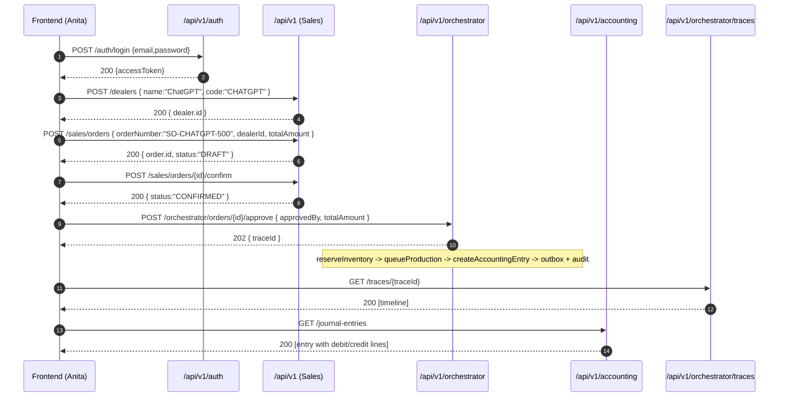

# Demo: Customer “ChatGPT” Buys 500 Buckets

End-to-end, human-style walkthrough using existing APIs. Assumes dev stack from `docker-compose.yml` and seeded admin user.

- Company: `BBP`
- Persona: Anita (Sales Manager)
- Customer: “ChatGPT” (as a Dealer)

## High-Level Flow

1) Login → get JWT
2) Create Dealer “ChatGPT”
3) Create Sales Order (500 buckets) and confirm it
4) Approve via Orchestrator → reserve status, create production plan, post accounting journal, enqueue event, write audit
5) Inspect trace and journal (ledger)

## Sequence Diagram



## Concrete API Calls

```bash
# 1) Login (get JWT)
curl -s -X POST http://localhost:8081/api/v1/auth/login \
  -H 'Content-Type: application/json' \
  -d '{"email":"admin@bbp.dev","password":"ChangeMe123!"}'

# export token
export TOKEN="<paste accessToken>"

# 2) Create customer “ChatGPT” (dealer)
curl -s -X POST http://localhost:8081/api/v1/dealers \
  -H 'Authorization: Bearer '$TOKEN \
  -H 'X-Company-Id: BBP' \
  -H 'Content-Type: application/json' \
  -d '{"name":"ChatGPT","code":"CHATGPT","email":"chatgpt@openai.com","phone":"N/A","creditLimit":500000}'

# capture dealerId from response
export DEALER_ID=<numeric-id>

# 3) Create sales order for 500 buckets (price * 500 in totalAmount)
curl -s -X POST http://localhost:8081/api/v1/sales/orders \
  -H 'Authorization: Bearer '$TOKEN \
  -H 'X-Company-Id: BBP' \
  -H 'Content-Type: application/json' \
  -d '{"orderNumber":"SO-CHATGPT-500","dealerId":'$DEALER_ID',"totalAmount":125000.50,"currency":"INR","notes":"500 buckets"}'

# capture order numeric id
export ORDER_ID=<numeric-id>

# 4) Confirm order (DRAFT -> CONFIRMED)
curl -s -X POST http://localhost:8081/api/v1/sales/orders/$ORDER_ID/confirm \
  -H 'Authorization: Bearer '$TOKEN -H 'X-Company-Id: BBP'

# 5) Approve via orchestrator (triggers workflow + journal + event)
curl -s -X POST http://localhost:8081/api/v1/orchestrator/orders/$ORDER_ID/approve \
  -H 'Authorization: Bearer '$TOKEN -H 'X-Company-Id: BBP' \
  -H 'Content-Type: application/json' \
  -d '{"approvedBy":"anita@bbp.dev","totalAmount":125000.50}'

# capture trace id from response
export TRACE_ID=<uuid>

# 6) Inspect trace timeline
curl -s http://localhost:8081/api/v1/orchestrator/traces/$TRACE_ID | jq .

# 7) Inspect ledger entries (journal)
curl -s http://localhost:8081/api/v1/accounting/journal-entries \
  -H 'Authorization: Bearer '$TOKEN -H 'X-Company-Id: BBP' | jq '.data[] | select(.referenceNumber|contains("SALE-"))'
```

## What Updates Where?

- Order status transitions: `DRAFT -> CONFIRMED -> RESERVED` via Sales + Orchestrator
- Accounting: Journal entry posted with two lines (debit/credit) under a reference `SALE-<orderId>`
- Events: Outbox stores `OrderApprovedEvent`, Outbox Publisher sends to RabbitMQ
- Trace: `AuditRecord` timeline is available by `traceId`

## Current Limitations (as-implemented)

- Finished-goods inventory deduction is not implemented in this flow. Inventory module models raw‑materials intake/batches; sales deduction would be a follow‑up feature.
- There is no invoicing/billing module yet. The journal entry serves as the accounting record.
- Dealer AR (outstanding balance) is not updated by this workflow.
