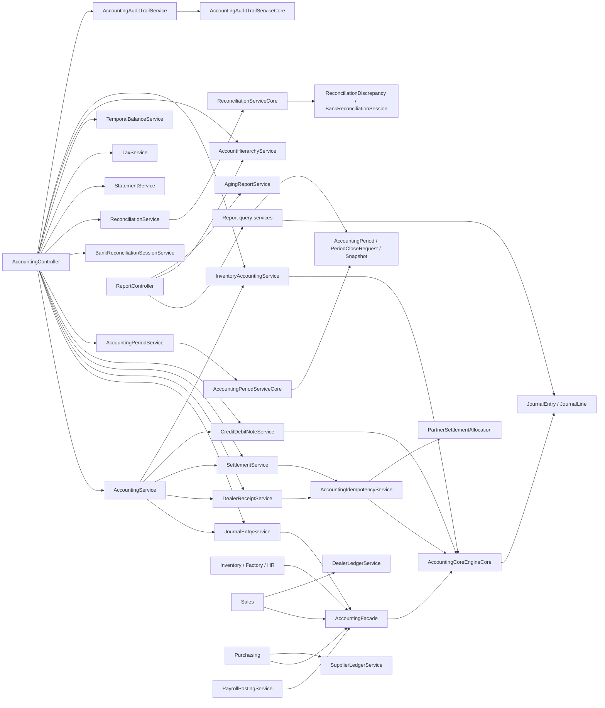

# Accounting Module Map

Branch truth:
- Worktree: `/Users/anas/Documents/Factory/bigbrightpaints-erp_worktrees/erp-stabilization-program/erp-20-report-controller-fix`
- Branch: `feature/erp-stabilization-program--erp-20--report-controller-review-fix`
- Head: `6f688e3c3305575ca1d8931549fde5d77913e8f6`

This map is a code-grounded accounting inventory for the live ERP-20 review-fix branch. It is not a product brief. It is a dependency and ownership map for cleanup planning.

## 1. Canonical dependency graph

## 2. Ownership map

### 2.1 Controllers

- [AccountingController.java](/Users/anas/Documents/Factory/bigbrightpaints-erp_worktrees/erp-stabilization-program/erp-20-report-controller-fix/erp-domain/src/main/java/com/bigbrightpaints/erp/modules/accounting/controller/AccountingController.java)
  Purpose: the main accounting transport surface for accounts, journals, receipts, settlements, notes, period close, reconciliation, statements, audit, temporal queries, and hierarchy queries.
- [AccountingCatalogController.java](/Users/anas/Documents/Factory/bigbrightpaints-erp_worktrees/erp-stabilization-program/erp-20-report-controller-fix/erp-domain/src/main/java/com/bigbrightpaints/erp/modules/accounting/controller/AccountingCatalogController.java)
  Purpose: accounting-prefixed catalog/product operations that currently overlap with production catalog ownership.
- [AccountingConfigurationController.java](/Users/anas/Documents/Factory/bigbrightpaints-erp_worktrees/erp-stabilization-program/erp-20-report-controller-fix/erp-domain/src/main/java/com/bigbrightpaints/erp/modules/accounting/controller/AccountingConfigurationController.java)
  Purpose: read-only accounting configuration health diagnostics.
- [AccountingAuditTrailController.java](/Users/anas/Documents/Factory/bigbrightpaints-erp_worktrees/erp-stabilization-program/erp-20-report-controller-fix/erp-domain/src/main/java/com/bigbrightpaints/erp/modules/accounting/controller/AccountingAuditTrailController.java)
  Purpose: filtered audit-trail query endpoint.
- [OpeningBalanceImportController.java](/Users/anas/Documents/Factory/bigbrightpaints-erp_worktrees/erp-stabilization-program/erp-20-report-controller-fix/erp-domain/src/main/java/com/bigbrightpaints/erp/modules/accounting/controller/OpeningBalanceImportController.java)
  Purpose: multipart opening-balance import entrypoint.
- [PayrollController.java](/Users/anas/Documents/Factory/bigbrightpaints-erp_worktrees/erp-stabilization-program/erp-20-report-controller-fix/erp-domain/src/main/java/com/bigbrightpaints/erp/modules/accounting/controller/PayrollController.java)
  Purpose: one-call payroll batch payment shortcut under accounting.
- [TallyImportController.java](/Users/anas/Documents/Factory/bigbrightpaints-erp_worktrees/erp-stabilization-program/erp-20-report-controller-fix/erp-domain/src/main/java/com/bigbrightpaints/erp/modules/accounting/controller/TallyImportController.java)
  Purpose: migration-time Tally XML import.
- [ReportController.java](/Users/anas/Documents/Factory/bigbrightpaints-erp_worktrees/erp-stabilization-program/erp-20-report-controller-fix/erp-domain/src/main/java/com/bigbrightpaints/erp/modules/reports/controller/ReportController.java)
  Purpose: canonical reporting host for `/api/v1/reports/**`.
- [RawMaterialController.java](/Users/anas/Documents/Factory/bigbrightpaints-erp_worktrees/erp-stabilization-program/erp-20-report-controller-fix/erp-domain/src/main/java/com/bigbrightpaints/erp/modules/inventory/controller/RawMaterialController.java)
  Purpose: inventory-owned controller with some accounting-prefixed raw-material routes.

### 2.2 Internal canonical engines

- [AccountingCoreEngineCore.java](/Users/anas/Documents/Factory/bigbrightpaints-erp_worktrees/erp-stabilization-program/erp-20-report-controller-fix/erp-domain/src/main/java/com/bigbrightpaints/erp/modules/accounting/internal/AccountingCoreEngineCore.java)
  Purpose: canonical posting engine for journal creation, reversal, receipts, settlements, payroll posting, inventory adjustments, and ledger-side money-state mutation.
- [AccountingFacadeCore.java](/Users/anas/Documents/Factory/bigbrightpaints-erp_worktrees/erp-stabilization-program/erp-20-report-controller-fix/erp-domain/src/main/java/com/bigbrightpaints/erp/modules/accounting/internal/AccountingFacadeCore.java)
  Purpose: request-shaping and manual-journal facade over the core engine.
- [AccountingPeriodServiceCore.java](/Users/anas/Documents/Factory/bigbrightpaints-erp_worktrees/erp-stabilization-program/erp-20-report-controller-fix/erp-domain/src/main/java/com/bigbrightpaints/erp/modules/accounting/internal/AccountingPeriodServiceCore.java)
  Purpose: canonical period lifecycle engine for request-close, approve-close, reject-close, lock, reopen, and snapshot/closing-journal behavior.
- [ReconciliationServiceCore.java](/Users/anas/Documents/Factory/bigbrightpaints-erp_worktrees/erp-stabilization-program/erp-20-report-controller-fix/erp-domain/src/main/java/com/bigbrightpaints/erp/modules/accounting/internal/ReconciliationServiceCore.java)
  Purpose: canonical reconciliation engine for bank, subledger, discrepancy, and GST reconciliation behavior.
- [AccountingAuditTrailServiceCore.java](/Users/anas/Documents/Factory/bigbrightpaints-erp_worktrees/erp-stabilization-program/erp-20-report-controller-fix/erp-domain/src/main/java/com/bigbrightpaints/erp/modules/accounting/internal/AccountingAuditTrailServiceCore.java)
  Purpose: canonical audit-trail query engine.

### 2.3 Service clusters

- Posting/orchestration:
  - `AccountingService`: umbrella delegator; broad surface, not the canonical writer.
  - `JournalEntryService`: journal list/create/manual/reversal/cascade-reverse surface.
  - `AccountingFacade`: manual-journal and payroll-payment request construction.
  - `AccountingIdempotencyService`: idempotent execution facade for receipts/settlements/journals.
  - `DealerReceiptService`: dealer receipt normalization.
  - `SettlementService`: dealer/supplier settlement normalization.
  - `CreditDebitNoteService`: credit note, debit note, accrual, and bad-debt posting.
  - `InventoryAccountingService`: landed cost, revaluation, and WIP accounting.

- Period close / reconciliation:
  - `AccountingPeriodService`: wrapper around period lifecycle and maker-checker flow.
  - `AccountingPeriodSnapshotService`: snapshot capture/delete.
  - `ClosedPeriodPostingExceptionService`: explicit admin exception authorization for closed periods.
  - `BankReconciliationSessionService`: canonical session workflow for bank reconciliation.
  - `ReconciliationService`: wrapper around discrepancy and subledger reconciliation.

- Reporting / balances / statements:
  - `AgingReportService`: aged receivables, dealer aging, DSO.
  - `StatementService`: dealer/supplier statements, aging, PDF exports.
  - `TemporalBalanceService`: as-of balances, trial balance snapshots, activity, balance comparison.
  - `AccountHierarchyService`: chart-of-accounts tree, balance-sheet hierarchy, income-statement hierarchy.
  - `TaxService`: GST return and reconciliation outputs.
  - `GstService`: low-level GST computation helpers.

- Audit / compliance:
  - `AccountingAuditService`: audit digest surface.
  - `AccountingAuditTrailService`: transaction-detail audit-trail surface.
  - `AuditTrailQueryService`: filterable query API.
  - `AccountingComplianceAuditService`: enterprise audit writes for sensitive actions.
  - `AuditDigestScheduler`: scheduled digest emitter.

- Master data / imports:
  - `CompanyDefaultAccountsService`: company default-account config.
  - `CompanyAccountingSettingsService`: payroll/tax-account settings.
  - `ReferenceNumberService`: canonical reference generation.
  - `JournalReferenceResolver`: reference lookup across direct, legacy, and canonical mappings.
  - `OpeningBalanceImportService`: opening-balance import.
  - `TallyImportService`: Tally XML import.

- Partner ledgers:
  - `DealerLedgerService`: dealer AR ledger rows and current balance.
  - `SupplierLedgerService`: supplier AP ledger rows and current balance.
  - `AbstractPartnerLedgerService`: shared ledger-entry template.

### 2.4 Domain truth stores

- Journals and references:
  - `JournalEntry`, `JournalLine`, `JournalReferenceMapping`
- Period control:
  - `AccountingPeriod`, `PeriodCloseRequest`, `AccountingPeriodSnapshot`, `AccountingPeriodTrialBalanceLine`
- Settlement and ledgers:
  - `DealerLedgerEntry`, `SupplierLedgerEntry`, `PartnerSettlementAllocation`
- Reconciliation:
  - `BankReconciliationSession`, `BankReconciliationItem`, `ReconciliationDiscrepancy`
- Imports and adjunct:
  - `OpeningBalanceImport`, `TallyImport`

Important naming issue:
- [ClosedPeriodPostingException.java](/Users/anas/Documents/Factory/bigbrightpaints-erp_worktrees/erp-stabilization-program/erp-20-report-controller-fix/erp-domain/src/main/java/com/bigbrightpaints/erp/modules/accounting/domain/ClosedPeriodPostingException.java)
  Purpose in practice: persisted override record, not a thrown exception type.

## 3. Canonical route families

### 3.1 Canonical current-state

- `/api/v1/reports/**` in [ReportController.java](/Users/anas/Documents/Factory/bigbrightpaints-erp_worktrees/erp-stabilization-program/erp-20-report-controller-fix/erp-domain/src/main/java/com/bigbrightpaints/erp/modules/reports/controller/ReportController.java)
  Purpose: balance sheet, P&L, trial balance, cash flow, aged debtors, inventory valuation, GST return, hierarchy, aging, DSO, and export request/download.
- `/api/v1/accounting/journals/*`
  Purpose: manual journal and reversal family.
- `/api/v1/accounting/receipts/*`, `/settlements/*`, `/suppliers/payments`
  Purpose: cash receipt/payment and settlement surfaces.
- `/api/v1/accounting/periods/*` request-close, approve-close, reject-close, lock, reopen
  Purpose: canonical auditable period-close workflow.
- `/api/v1/accounting/reconciliation/bank/sessions/*`
  Purpose: canonical bank reconciliation session workflow.

### 3.2 Still-live stale or duplicate surfaces

- `/api/v1/accounting/journal-entries*`
  Problem: parallel journal family beside `/journals/*`.
- `/api/v1/accounting/periods/{periodId}/close`
  Problem: dead route; service hard-rejects and forces maker-checker.
- `/api/v1/accounting/reconciliation/bank`
  Problem: one-shot legacy wrapper over session workflow.
- `/api/v1/accounting/audit/digest` and `/api/v1/accounting/audit/digest.csv`
  Problem: deprecated digest surface still live.
- `/api/v1/accounting/payroll/payments/batch`
  Problem: shortcut surface beside broader HR/payroll lifecycle.
- `/api/v1/accounting/catalog/*`
  Problem: accounting-prefixed catalog ownership overlaps production catalog.
- `/api/v1/catalog/products*`
  Problem: inventory-owned raw-material operations exposed under accounting prefix.

## 4. Cross-module ownership

- Sales owns dispatch, sales returns, invoice truth, and dealer account provisioning; accounting is the journal sink and dealer ledger store.
- Purchasing owns purchase invoice/return truth and supplier account provisioning; accounting is the journal sink and supplier ledger store.
- Inventory and factory own stock movement and production truth; accounting receives events or facade calls to post journals.
- HR owns payroll run lifecycle; accounting owns payroll journal posting primitives and currently also exposes batch payment endpoints.

## 5. Remaining hard-cut gaps after ERP-20

### 5.1 Route and controller cleanup

- Remove `/journal-entries*` and keep `/journals/*` only.
- Delete dead `/periods/{periodId}/close`.
- Delete legacy `/reconciliation/bank`.
- Delete deprecated audit digest endpoints if the audit-trail surface is the supported path.
- Decide whether `PayrollController` survives or payroll payment becomes HR-owned only.
- Decide whether accounting-prefixed catalog/raw-material routes are canonical or should move fully back to owning modules.

### 5.2 Compatibility and fallback seams

- [JournalReferenceResolver.java:34](/Users/anas/Documents/Factory/bigbrightpaints-erp_worktrees/erp-stabilization-program/erp-20-report-controller-fix/erp-domain/src/main/java/com/bigbrightpaints/erp/modules/accounting/service/JournalReferenceResolver.java#L34)
  Live seam: direct lookup, then legacy mappings, then canonical mappings.
- [BankReconciliationSessionService.java:256](/Users/anas/Documents/Factory/bigbrightpaints-erp_worktrees/erp-stabilization-program/erp-20-report-controller-fix/erp-domain/src/main/java/com/bigbrightpaints/erp/modules/accounting/service/BankReconciliationSessionService.java#L256)
  Live seam: `reconcileLegacy(...)` compatibility wrapper.
- Settlement request models
  Live seam: header-level `amount` plus auto-expanded FIFO allocations and legacy idempotency/header support.
- `Idempotency-Key` plus `X-Idempotency-Key`
  Live seam: dual-header acceptance still exists in controller normalization.
- Report query defaults
  Live seam: `ReportQuerySupport` still infers current month / first available period when explicit range inputs are absent.
- Tax fallback
  Live seam: `TaxService` still computes taxable amount heuristically when explicit taxable amount is absent.

### 5.3 Structural duplication

- `AccountingService` overlaps with `JournalEntryService`, `SettlementService`, `CreditDebitNoteService`, and `InventoryAccountingService`.
- `AccountingCoreEngine`, `AccountingCoreLogic`, and `AccountingCoreService` are wrapper layers over the same core engine.
- Dealer and supplier account provisioning logic is duplicated in sales and purchasing services.
- Dealer and supplier settlement logic is largely mirrored and should be audited for one canonical shared model where safe.

## 6. Test topology

High-signal correctness suites:
- accounting controller/service/domain tests
- reports controller/service tests
- truthsuite runtime/accounting/reports/periodclose
- accounting e2e tests
- codered parity and concurrency tests

Stale-leaning or non-core proof:
- benchmark-only accounting perf tests
- performance explain/budget tests for diagnostics rather than accounting correctness
- explicit compatibility tests such as purchase audit-trail repository compatibility coverage

Missing high-value proof:
- direct canonical cash-flow controller/service coverage is still thin compared with balance sheet, P&L, and aged debtors.

## 7. Recommended next cleanup packets

1. Controller hard-cut packet
   - delete dead and alias routes
   - collapse journal family to `/journals/*`
   - collapse bank reconciliation to session workflow only

2. Settlement and idempotency packet
   - remove legacy idempotency headers and old replay/legacy fingerprint branches
   - cut header-level settlement compatibility if clients are ready

3. Report input strictness packet
   - remove silent period/range defaulting in query support
   - require explicit range semantics where money-state meaning changes

4. Cross-module ownership packet
   - settle payroll ownership
   - settle catalog/raw-material ownership
   - unify partner account provisioning rules

5. Audit and reference cleanup packet
   - retire digest endpoints if unsupported
   - cut legacy journal-reference mapping fallback if no live dependency remains

## 8. Practical canonical sentence

Current accounting truth should flow through:
- domain-owned business events in sales, purchasing, inventory, factory, and HR
- into one accounting posting engine in `AccountingCoreEngineCore`
- with reports served only from `/api/v1/reports/**`
- and period close served only through request/approve/reject/reopen workflows
