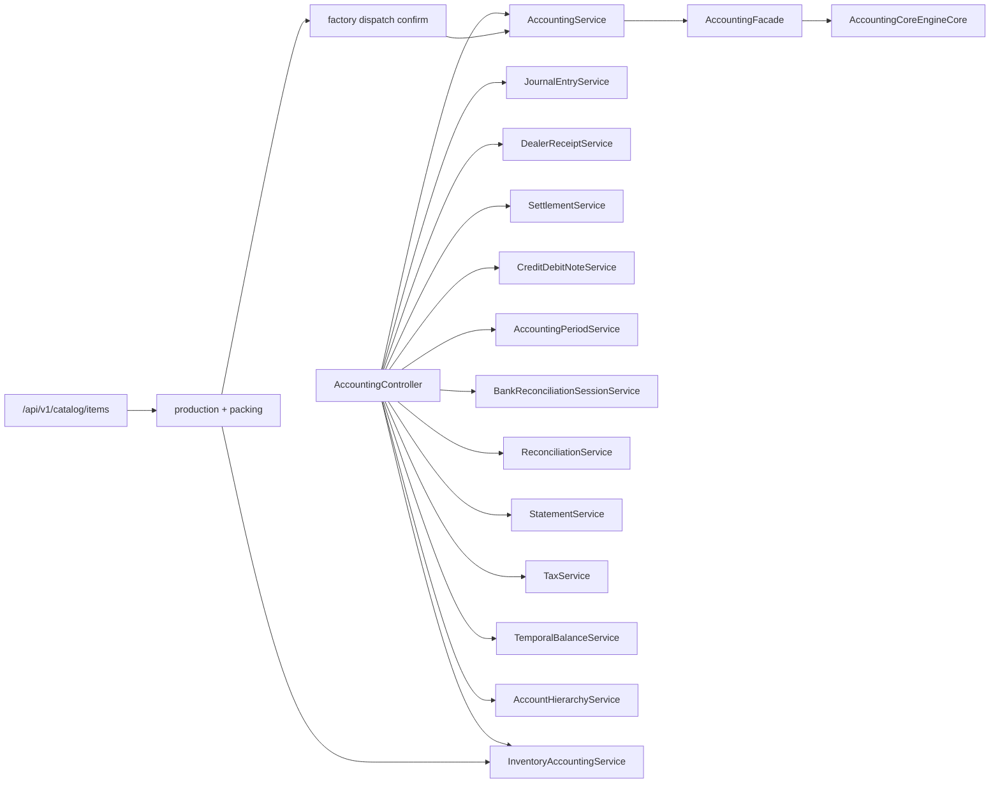

# Accounting Module Map

This map is a code-grounded accounting inventory for the current ERP-38 branch state. It is not a product brief. It is a dependency and ownership map for cleanup planning.

## 1. Canonical dependency graph

## 2. Ownership map

### 2.1 Controllers

- `AccountingController`
  Purpose: main accounting transport surface for journals, receipts, settlements, period close, reconciliation, statements, and supporting defaults.
- `CatalogController`
  Purpose: canonical stock-bearing setup/readiness host for brands and items on `/api/v1/catalog/**`.
- `DispatchController`
  Purpose: canonical factory dispatch confirmation plus prepared-slip and challan lookup under `/api/v1/dispatch/**`.
- `SalesController`
  Purpose: sales-order orchestration and downstream dispatch reconciliation support only; not a public dispatch-confirm write host.
- `ProductionLogController`
  Purpose: canonical production-batch creation on `POST /api/v1/factory/production/logs`.
- `PackingController`
  Purpose: canonical pack mutation on `POST /api/v1/factory/packing-records`.

### 2.2 Internal canonical engines

- `AccountingCoreEngineCore`
  Purpose: canonical posting engine for journal creation, reversal, receipts, settlements, payroll posting, inventory adjustments, and dispatch-side accounting mutation.
- `AccountingFacadeCore`
  Purpose: request shaping into the core posting engine.
- `AccountingPeriodServiceCore`
  Purpose: canonical period lifecycle engine.
- `ReconciliationServiceCore`
  Purpose: canonical reconciliation engine.

### 2.3 Service clusters

- Posting/orchestration:
  - `AccountingService`
  - `JournalEntryService`
  - `AccountingFacade`
  - `AccountingIdempotencyService`
  - `DealerReceiptService`
  - `SettlementService`
  - `CreditDebitNoteService`
  - `InventoryAccountingService`
- Setup and execution contributors:
  - `CatalogService` maintains item truth and readiness-aware reads on `/api/v1/catalog/items`
  - `ProductionLogService` turns ready raw materials into production batches and WIP truth
  - `PackingService` turns production output into sellable finished goods and packaging consumption truth
  - `SalesDispatchReconciliationService` applies downstream posting consequences behind the canonical factory dispatch confirmation route

## 3. Canonical route families

### 3.1 Setup and execution routes that matter to accounting

- `/api/v1/catalog/items`
  Purpose: canonical stock-bearing setup and readiness host.
- `/api/v1/catalog/import`
  Purpose: adjunct import path that must still land on the same item truth; not the primary operator setup host.
- `/api/v1/factory/production/logs`
  Purpose: canonical production-batch creation and raw-material consumption trigger.
- `/api/v1/factory/packing-records`
  Purpose: canonical pack mutation and packaging-consumption trigger.
- `/api/v1/dispatch/confirm`
  Purpose: canonical factory dispatch-confirm write and accounting posting trigger.
- `/api/v1/dispatch/{pending,preview/{slipId},slip/{slipId},order/{orderId}}`
  Purpose: operational lookup around the same factory-owned dispatch workspace.

### 3.2 Retired setup hosts that must stay retired

- `legacy product routes`
  Problem: stale pre-hard-cut setup story.
- `legacy accounting-prefixed product setup routes`
  Problem: stale accounting-prefixed stock-bearing setup host.

## 4. Cross-module ownership

- Catalog owns setup truth for brands and items.
- Factory owns production, packing, and final physical dispatch confirmation truth.
- Sales remains the order/commercial owner but not a second public shipment-posting host.
- Accounting remains the journal sink and reporting owner rather than a second setup workspace.
- Inventory mirrors and costing/posting consequences are automatic results of setup, production, packing, and dispatch events.

## 5. Remaining hard-cut review expectations

- do not describe `legacy product routes` or `legacy accounting-prefixed product setup routes` as live setup hosts
- do not describe any route other than `/api/v1/dispatch/confirm` as a supported dispatch-confirm write path
- keep batch -> pack -> dispatch wording consistent across accounting-facing docs
- treat `/api/v1/catalog/import` as an adjunct ingestion surface, not as proof that a separate stock-bearing setup host survived

## 6. Practical canonical sentence

Current accounting truth should flow through ready items on `/api/v1/catalog/items`, factory execution on `POST /api/v1/factory/production/logs` and `POST /api/v1/factory/packing-records`, and factory dispatch confirmation on `POST /api/v1/dispatch/confirm`, with accounting acting as the downstream posting engine rather than a competing setup host.
