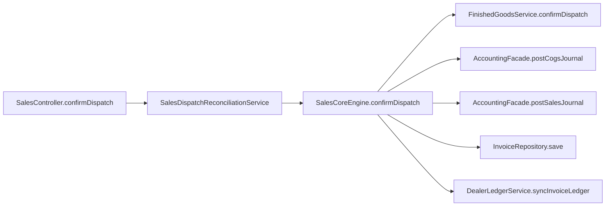

# Sales to Accounting Boundary

## Folder Map

- `modules/sales/controller`
  Purpose: orders, dispatch, dealers, dealer portal, credit overrides.
- `modules/sales/service`
  Purpose: dispatch/invoice orchestration, dealer provisioning, returns, dunning, credit posture.
- `modules/sales/util`
  Purpose: receivable-account provisioning helpers.
- `modules/invoice/controller|service|domain`
  Purpose: invoice read/send/export truth tightly coupled to dispatch/accounting truth.
- `modules/accounting/controller`
  Purpose for this slice: sales-return preview and posting.

## Canonical Sales Workflow

## Major Workflows

### Dispatch and Invoice Posting

- entry: `SalesController.confirmDispatch`
- canonical engine: `SalesCoreEngine.confirmDispatch`
- key steps:
  - lock company/order/slip
  - require dealer receivable account
  - compute revenue, GST, and COGS splits
  - post COGS journal
  - post sales journal
  - create or reuse invoice
  - sync dealer ledger and order accounting markers

### Sales Return

- entry: `AccountingController.previewSalesReturn` / `recordSalesReturn`
- canonical service: `SalesReturnService`
- key steps:
  - lock invoice
  - validate posted status and remaining quantities
  - build return lines
  - post return journal through accounting facade
  - relink correction journal
  - reverse inventory / COGS where needed

### Dealer Provisioning and Ledger

- entry: `DealerController.createDealer` / `updateDealer`
- key services:
  - `DealerService`
  - `DealerProvisioningSupport`
  - `DealerLedgerService`
- outputs:
  - dealer receivable account
  - live AR balance
  - dealer portal ledger/invoice/aging reads

## What Works

- dispatch accounting truth is concentrated in `SalesCoreEngine.confirmDispatch`
- dealer ledger sync is explicit
- dealer portal reads use accounting-backed ledger and invoice truth

## Duplicates and Bad Paths

- `SalesCoreEngine.createDealer/updateDealer` and `DealerService.createDealer/updateDealer` both provision receivable accounts
- `SalesFulfillmentService` overlaps dispatch/invoice orchestration and looks transitional
- `SalesService` is a broad compatibility shell around split services
- `SalesController` dealer alias routes duplicate `DealerController`
- `POST /api/v1/dealer-portal/credit-requests` is a permanent forbidden stub, not a workflow
- `POST /api/v1/sales/dispatch/reconcile-order-markers` is a repair utility, not a business path

## Review Hotspots

- `SalesCoreEngine.confirmDispatch`
- `SalesReturnService.processReturn`
- `DealerService.createDealer/updateDealer`
- `CreditLimitOverrideService`
- `InvoiceService.issueInvoiceForOrder`
- `DunningService.evaluateDealerHold`
