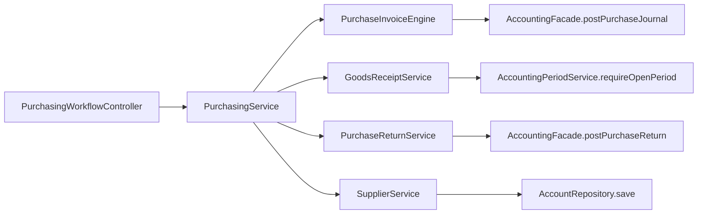

# Purchasing to Accounting Truth Paths

## Folder Map

- `modules/purchasing/controller`
  Purpose: PO, GRN, purchase invoice, purchase return, supplier CRUD.
- `modules/purchasing/service`
  Purpose: orchestration plus canonical purchase invoice engine and return service.
- `modules/purchasing/domain`
  Purpose: purchase, GRN, PO, and supplier aggregates with accounting links.
- `modules/purchasing/dto`
  Purpose: invoice, GRN, return, and supplier payloads that become AP truth.

## Canonical Workflow Graph

## Major Workflows

### Purchase Invoice Posting

- entry: `PurchasingService.createPurchase`
- canonical engine: `PurchaseInvoiceEngine.createPurchase`
- key steps:
  - validate supplier/AP account and GRN ownership
  - post AP journal through accounting facade
  - link journal to `RawMaterialPurchase`
  - mark GRN invoiced and update PO status

### Purchase Return

- entry: `PurchasingService.recordPurchaseReturn`
- canonical service: `PurchaseReturnService`
- key steps:
  - require posted purchase
  - validate purchase line ownership
  - compute tax
  - post correction journal
  - link reversal metadata
  - reduce stock and outstanding amount

### GRN and Period Gate

- entry: `GoodsReceiptService.createGoodsReceipt`
- key rule:
  - GRN is inventory-first
  - accounting is enforced through `AccountingPeriodService.requireOpenPeriod`
  - AP link happens later at invoice time

### Supplier Provisioning

- entry: `SupplierService.createSupplier`
- key outputs:
  - payable account `AP-*`
  - supplier/account link
  - live AP balance reads via `SupplierLedgerService`

## What Works

- real AP write semantics are concentrated in `PurchaseInvoiceEngine`
- purchase return accounting is explicit and linked back to the original purchase
- supplier provisioning owns payable-account creation clearly

## Duplicates and Bad Paths

- `PurchasingService` is mostly a router over specialized services
- `PurchaseInvoiceService` is nearly pure pass-through to `PurchaseInvoiceEngine`
- `PurchaseInvoiceEngine.setPurchaseOrderService(...)` is setter wiring and a small seam
- `PurchaseResponseMapper` mixes purchasing read state with accounting settlement references
- `Supplier.outstandingBalance` mirrors subledger truth and can drift from live ledger reads

## Review Hotspots

- `PurchaseInvoiceEngine.createPurchase`
- `PurchaseInvoiceEngine.postPurchaseEntry`
- `PurchaseReturnService.recordPurchaseReturn`
- `GoodsReceiptService.createGoodsReceipt`
- `SupplierService.createSupplier`
- `PurchaseResponseMapper`
