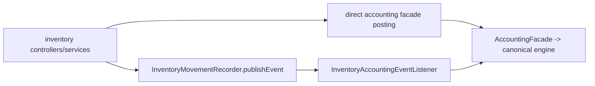

# Inventory to Accounting Posting Paths

## Folder Map

- `modules/inventory/controller`
  Purpose: opening stock, raw material intake/adjustment, finished-good batch registration, dispatch confirmation.
- `modules/inventory/service`
  Purpose: direct-post inventory flows plus movement publication for event-driven accounting.
- `modules/inventory/event`
  Purpose: movement and valuation-change contracts consumed by accounting listener.
- `modules/inventory/domain`
  Purpose: raw-material, finished-good, batch, movement, adjustment, and import truth.

## Two-Lane Model

## Major Workflows

### Opening Stock

- entry: `OpeningStockImportController.importOpeningStock`
- canonical path:
  - `OpeningStockImportService.processImport`
  - create inventory rows
  - `postOpeningStockJournal`
  - `AccountingFacade.postInventoryAdjustment("OPENING_STOCK", ...)`

### Raw Material Intake and Adjustment

- entry:
  - `RawMaterialController.intake`
  - `RawMaterialController.adjustRawMaterials`
- canonical path:
  - `RawMaterialService.recordReceipt` / `adjustStock`
  - direct accounting facade post

### Finished-Good Batch Receipt

- entry: `FinishedGoodController.registerBatch`
- canonical path:
  - `FinishedGoodsWorkflowEngineService.registerBatch`
  - `InventoryMovementRecorder.recordFinishedGoodMovement`
  - publish `InventoryMovementEvent`
  - `InventoryAccountingEventListener.onInventoryMovement`
  - `AccountingService.createJournalEntry`

### Dispatch Confirmation

- important distinction:
  - inventory emits movement
  - accounting listener skips canonical `SALES_ORDER` / `PACKAGING_SLIP` workflow labels
  - actual accounting ownership is outside this inventory->listener path

## What Works

- canonical inventory operations either post directly or intentionally hand off through a listener
- listener skip-list prevents double-posting on canonical sales/packaging workflows

## Duplicates and Bad Paths

- `RawMaterialService` has two receipt-style orchestration paths: `createBatch` and `recordReceipt`
- `OpeningStockImportService` is a bootstrap path, not a steady-state workflow
- `InventoryAdjustmentService` still duplicates some journal-shaping before handing off to accounting
- `InventoryMovementRecorder` only publishes on some movement families, so event-driven accounting is partial
- `InventoryValuationChangedEvent` has a listener but no obvious publisher in this slice
- `FinishedGoodsWorkflowEngineService` manually builds collaborators and acts as a hidden composition root

## Review Hotspots

- `InventoryAccountingEventListener.onInventoryMovement`
- `InventoryAccountingEventListener.onInventoryValuationChanged`
- `OpeningStockImportService.processImport`
- `RawMaterialService.recordReceipt`
- `RawMaterialService.adjustStock`
- `InventoryAdjustmentService.createAdjustmentInternal`
- `FinishedGoodsWorkflowEngineService.registerBatch`
- `InventoryMovementRecorder.publishMovementEventIfSupported`
