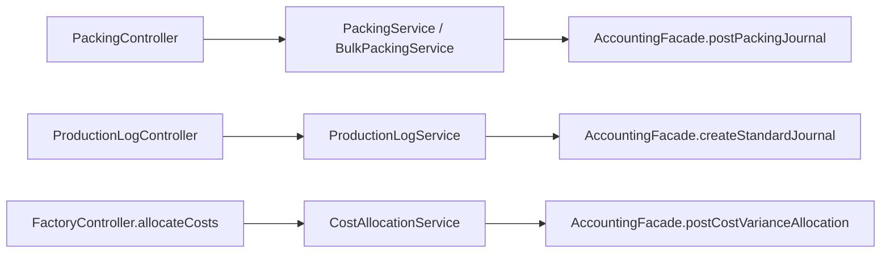

# Factory and Production Accounting Posting Paths

## Folder Map

- `modules/factory/controller`
  Purpose: packing, production logs, cost allocation, and one deprecated batch-logging route.
- `modules/factory/service`
  Purpose: real manufacturing accounting feeder layer.
- `modules/factory/domain`
  Purpose: production log, packing record, and legacy production batch truth.
- `modules/production/service`
  Purpose: product/catalog account metadata seeding, not direct journal posting.

## Canonical Workflow Graph

## Major Workflows

### Packing

- single-log path:
  - `PackingController.recordPacking`
  - `PackingService.recordPacking`
  - inventory consumption
  - `PackingJournalBuilder`
  - `AccountingFacade.postPackingJournal`
- completion path:
  - `PackingController.completePacking`
  - wastage-to-WIP journal

### Bulk-to-Size Packing

- entry: `PackingController.packBulkToSizes`
- flow:
  - `BulkPackingService.pack`
  - create child batches
  - consume bulk FG stock
  - post packaging journal

### Production Logs

- entry: `ProductionLogController.create`
- flow:
  - `ProductionLogService.createLog`
  - post material journal
  - post labor/overhead journal
  - register semi-finished batch and journal

### Cost Allocation

- entry: `FactoryController.allocateCosts`
- flow:
  - `CostAllocationService.allocateCosts`
  - update batch costs
  - post cost variance allocation

## What Works

- actual journal sinks are narrow and explicit
- factory flows consistently reach accounting through the facade layer

## Duplicates and Bad Paths

- `FactoryService.logBatch()` is deprecated and stale relative to `ProductionLogService`
- journal assembly is duplicated across `PackingJournalBuilder`, `PackingBatchService`, `ProductionLogService`, and `CostAllocationService`
- `PackingService` and `BulkPackingService` are separate but semantically close enough to drift
- `ProductionCatalogService` stores accounting truth in product metadata and is a weak ownership seam

## Review Hotspots

- `PackingService.recordPacking`
- `PackingService.completePacking`
- `BulkPackingService.pack`
- `ProductionLogService.createLog`
- `ProductionLogService.postMaterialJournal`
- `ProductionLogService.postLaborOverheadJournal`
- `CostAllocationService.allocateCosts`
- `PackingBatchService.postPackingSessionJournal`
- `AccountingFacadeCore.postPackingJournal`
