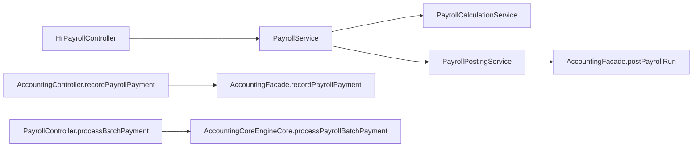

# HR Payroll to Accounting Bridge

## Folder Map

- `modules/hr/controller`
  Purpose: canonical payroll lifecycle routes.
- `modules/hr/service`
  Purpose: calculate, approve, post, and mark paid.
- `modules/hr/domain`
  Purpose: payroll run and payroll line truth with accounting linkage fields.
- `modules/accounting/controller`
  Purpose for this slice: single and batch payroll payment endpoints.
- `modules/accounting/internal`
  Purpose for this slice: actual payroll journal/payment implementations.

## Canonical Workflow Graph

## Major Workflows

### Payroll Run Posting

- entry: `HrPayrollController.postPayroll`
- canonical path:
  - `PayrollService.postPayrollToAccounting`
  - `PayrollPostingService.postPayrollToAccounting`
  - `AccountingFacade.postPayrollRun`
  - `AccountingCoreEngineCore.postPayrollRun`
  - mark run `POSTED` and link journal

### Payroll Payment

- entry: `AccountingController.recordPayrollPayment`
- canonical path:
  - `AccountingFacade.recordPayrollPayment`
  - `AccountingCoreEngineCore.recordPayrollPayment`
  - require posted payroll journal and salary-payable account
  - link payment journal to run

### Paid Finalization

- entry: `HrPayrollController.markAsPaid`
- key point:
  - HR updates line payment state, payment reference, payment date, and employee advances
  - accounting is not called here; it consumes the existing payment journal link

### Batch Payroll Payment

- entry: `PayrollController.processBatchPayment`
- key point:
  - accounting creates run + journals directly
  - this path can bypass richer HR paid-finalization semantics

## What Works

- HR owns payroll lifecycle
- accounting owns journal creation and payment journal recording
- canonical HR route family is already separate from accounting route family

## Duplicates and Bad Paths

- legacy alias `/api/v1/hr/payroll-runs` still exists as `GONE`
- `PayrollRun` and `PayrollRunLine` still carry legacy compatibility fields and fallback getters
- `PayrollPostingService` still accepts either `journalEntryId` or legacy relation linkage
- batch payment path can set a run `PAID` without the full HR-side finalization data

## Review Hotspots

- `PayrollPostingService.postPayrollToAccounting`
- `PayrollPostingService.markAsPaid`
- `PayrollCalculationService.calculatePayroll`
- `AccountingCoreEngineCore.recordPayrollPayment`
- `AccountingCoreEngineCore.processPayrollBatchPayment`
- `PayrollRun`
- `PayrollRunLine`
