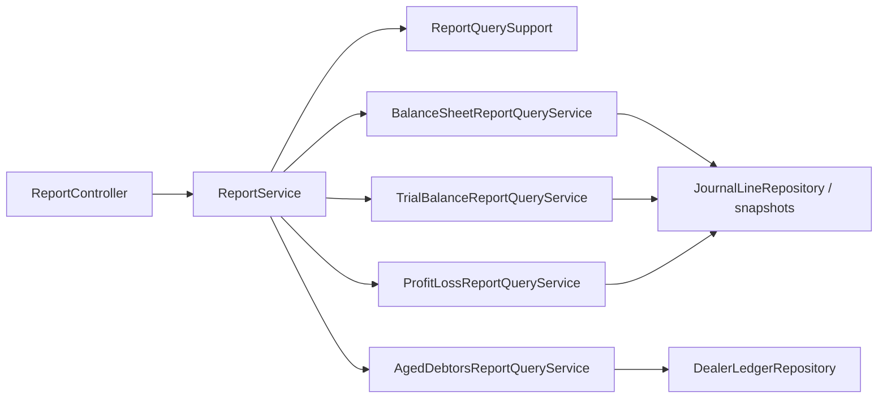

# Reporting Truth Sources and Query Paths

## Folder Map

- `modules/reports/controller`
  Purpose: canonical `/api/v1/reports/**` endpoints.
- `modules/reports/service`
  Purpose: query/orchestration layer over accounting truth.
- `modules/reports/dto`
  Purpose: payloads plus report provenance metadata.
- accounting read-side dependencies:
  - `JournalLineRepository`
  - `JournalEntryRepository`
  - `AccountingPeriodSnapshotRepository`
  - `AccountingPeriodTrialBalanceLineRepository`
  - `DealerLedgerRepository`
  - `SupplierLedgerRepository`
  - `AccountHierarchyService`
  - `AgingReportService`
  - `StatementService`

## Truth Sources

- posted journal lines
- closed-period snapshots and snapshot trial-balance lines
- dealer/supplier subledgers

## Canonical Workflow Graph

## Major Workflows

### Balance Sheet

- route: `/api/v1/reports/balance-sheet`
- source selection:
  - `ReportQuerySupport.resolveWindow`
  - snapshot if closed period
  - otherwise live journal summaries plus current earnings logic

### Trial Balance

- route: `/api/v1/reports/trial-balance`
- source selection:
  - snapshot lines for closed period
  - otherwise journal summaries

### Profit and Loss

- route: `/api/v1/reports/profit-loss`
- important distinction:
  - always reads live journal summaries
  - no true snapshot branch today

### Aging

- two ownership paths:
  - `AgedDebtorsReportQueryService` for aged debtors endpoint
  - `AgingReportService` for receivables/dealer aging/DSO routes

### Cash Flow

- route: `/api/v1/reports/cash-flow`
- current behavior:
  - scans posted journals directly
  - uses heuristic counterparty classification
  - no date-window discipline comparable to other financial reports
  - no snapshot branch

### Account Statement

- route: `/api/v1/reports/account-statement`
- current behavior:
  - dealer-only balance rollup
  - not the fuller statement engine in `StatementService`

## What Works

- report hosting is canonical under `/api/v1/reports/**`
- balance sheet and trial balance respect closed-period snapshot truth
- metadata/provenance objects exist and are worth preserving

## Duplicates and Bad Paths

- `ReportService.resolveTrialBalanceLines` is stale duplicate logic
- balance sheet and trial balance duplicate snapshot-vs-live branching
- P&L metadata can imply snapshot while data still comes from live journals
- cash flow is the biggest non-canonical path in reporting
- aged debtors and aging service split ownership semantically
- account statement naming drifts from what it really returns

## Review Hotspots

- `ReportService.cashFlow`
- `ReportService.accountStatement`
- `BalanceSheetReportQueryService`
- `TrialBalanceReportQueryService`
- `ProfitLossReportQueryService`
- `AgedDebtorsReportQueryService`
- `AccountingPeriodSnapshotService.captureSnapshot`
- `AccountingPeriodServiceCore.closePeriod/reopenPeriod`
