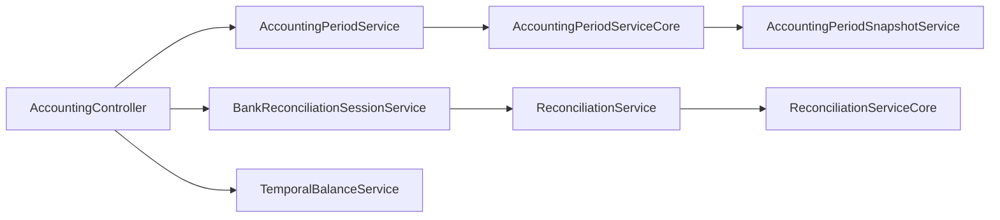

# Period Close, Reconciliation, and Temporal Truth

## Folder Map

- `modules/accounting/controller`
  Purpose for this slice: period close, checklist, bank reconciliation sessions, discrepancies, temporal queries.
- `modules/accounting/service`
  Purpose: public wrappers, snapshot service, bank reconciliation session orchestration, temporal balances.
- `modules/accounting/internal`
  Purpose: canonical period-close and reconciliation engines.
- `modules/accounting/domain`
  Purpose: period, snapshot, session, discrepancy, and close-request persistence.

## Canonical Workflow Graph

## Major Workflows

### Request Close / Approve Close / Reopen

- maker-checker path:
  - `requestPeriodClose`
  - `approvePeriodClose`
  - `rejectPeriodClose`
  - `reopenPeriod`
- canonical engine:
  - `AccountingPeriodServiceCore`
- close work includes:
  - compute net income
  - post closing journal
  - capture snapshot
  - lock metadata
  - optionally create next period

### Bank Reconciliation Sessions

- canonical path:
  - `startSession`
  - `updateItems`
  - `completeSession`
- old path:
  - `reconcileLegacy(...)`

### Discrepancy Resolution

- `reconcileSubledgerBalances`
- `syncPeriodDiscrepancies`
- `resolveDiscrepancy`
- `createResolutionJournal`

### Temporal Queries

- `getBalanceAsOfDate`
- `getTrialBalanceAsOf`
- `getAccountActivity`
- `compareBalances`
- snapshot-first for closed periods, live journal lines otherwise

## What Works

- one real period engine exists
- one real reconciliation engine exists
- snapshot-backed temporal truth is explicit and fail-closed

## Duplicates and Bad Paths

- `/periods/{periodId}/close` is a dead route in practice
- `/reconciliation/bank` duplicates the session workflow
- controller/service auth can drift on close approval roles
- checklist flows default to latest open period when `periodId` is omitted
- discrepancy syncing writes against latest open period, which can bias state

## Review Hotspots

- `AccountingPeriodServiceCore.closePeriod`
- `AccountingPeriodServiceCore.reopenPeriod`
- `AccountingPeriodServiceCore.approvePeriodClose`
- `AccountingPeriodSnapshotService.captureSnapshot`
- `ReconciliationServiceCore.syncPeriodDiscrepancies`
- `ReconciliationServiceCore.resolveDiscrepancy`
- `BankReconciliationSessionService.completeSession`
- `TemporalBalanceService.resolveClosedSnapshot`
