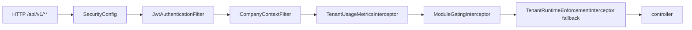

# Company, Auth, RBAC, and Portal Gating

## Folder Map

- `core/security`
  Purpose: authentication, company context, and password corridor.
- `modules/company`
  Purpose: tenant lifecycle, module enablement, runtime policy, switching, support.
- `modules/auth`
  Purpose: login, refresh, current user, logout, password flows.
- `modules/rbac`
  Purpose: system roles, permission seeding, role mutation rules.
- `modules/portal`
  Purpose: tenant/admin portal insights and runtime fallback enforcement.
- `modules/sales`
  Purpose for this slice: dealer portal surface.
- `modules/admin`
  Purpose: approvals, exports, runtime metrics, some provisioning.

## Admission Graph

## Major Workflows

### Company Context and Runtime Admission

- canonical admission gate: `CompanyContextFilter`
- validates:
  - company header/claim
  - membership
  - lifecycle
  - runtime policy
- sets `CompanyContextHolder`

### Module Gating

- `ModuleGatingInterceptor`
- important mappings:
  - `/api/v1/accounting` -> `ACCOUNTING`
  - `/api/v1/reports` -> `REPORTS_ADVANCED`
  - `/api/v1/portal` and `/api/v1/dealer-portal` -> `PORTAL`

### Auth-Time Admission

- `AuthService.login`
- `AuthService.refresh`
- company-scoped token issuance
- `AuthController.me()` returns current company context

### Dealer Portal Reads

- `DealerPortalController`
- `DealerPortalService`
- accounting-backed ledger and invoice reads
- explicit denial on dealer credit-request creation

## What Works

- company context contract is hard-cut and explicit
- module gating exists as a separate, visible layer
- dealer portal is self-scope constrained

## Duplicates and Bad Paths

- runtime admission is duplicated between `CompanyContextFilter` and `TenantRuntimeEnforcementInterceptor`
- module gating fail-opens for unmapped or core/null modules
- `modules/portal` and dealer portal under `modules/sales` are easy to confuse
- `AdminSettingsController /approvals` multiplexes unrelated approval domains
- `AdminUserService` and `DealerService` both provision dealer entities/receivable accounts
- role matrix logic and controller annotations can drift

## Review Hotspots

- `CompanyContextFilter`
- `TenantRuntimeEnforcementService`
- `ModuleGatingInterceptor`
- `AuthService`
- `DealerPortalService`
- `CompanyService`
- `RoleService`
- `AdminSettingsController`
