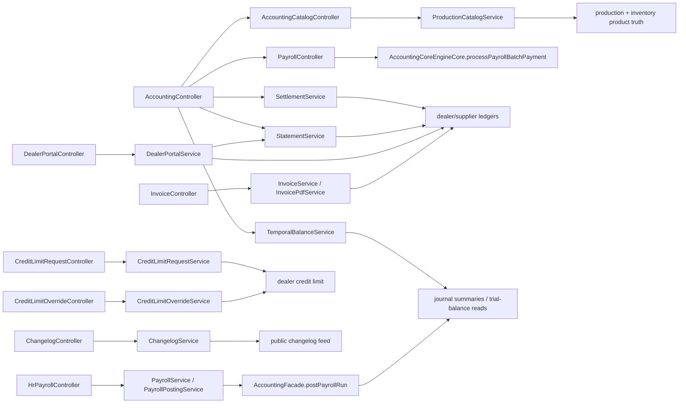

# Accounting Outward Flow Map

## Folder Map

- `modules/accounting/controller`
  Purpose: accounting-owned write and read entrypoints, including settlements, statements, payroll payment, temporal balances, and catalog wrapper routes.
- `modules/sales/controller`
  Purpose: dealer-facing ledger/aging views, durable credit-limit request routes, credit overrides, and dealer portal flows that either surface accounting truth or request accounting-adjacent approvals.
- `modules/invoice/controller`
  Purpose: invoice read, PDF, and email surfaces over accounting-backed receivable truth.
- `modules/production/controller`
  Purpose: production-side catalog read surfaces that share product and SKU truth with accounting catalog routes.
- `modules/hr/controller`
  Purpose: canonical payroll run lifecycle and the retired HR payroll alias surface.
- `modules/admin/controller`
  Purpose: changelog governance and other admin-owned outward surfaces that shape what users see.

## Outward Graph

## Major Workflow Families

### Accounting -> Catalog / SKU

- entrypoints:
  - `AccountingCatalogController.importCatalog`
  - `AccountingCatalogController.createProduct`
  - `AccountingCatalogController.createVariants`
  - `AccountingCatalogController.updateProduct`
- canonical path:
  - accounting route host
  - `ProductionCatalogService`
  - production product + brand repositories
  - finished-good / raw-material sync
- why it matters:
  - accounting can create or mutate product truth without going through the general `/api/v1/catalog/**` surface

### Accounting -> Customer / Supplier Statement Truth

- entrypoints:
  - `AccountingController.dealerStatement`
  - `AccountingController.supplierStatement`
  - `AccountingController.dealerAging`
  - `AccountingController.supplierAging`
- canonical path:
  - `StatementService`
  - dealer/supplier ledger repositories
  - optional PDF export endpoints over the same truth
- why it matters:
  - these are lower-level accounting helper reads beside the canonical public report host

### Accounting -> Dealer Credit / Exposure

- entrypoints:
  - `CreditLimitRequestController` list/create/approve/reject
  - `CreditLimitOverrideController` create/list/approve/reject
  - `DealerPortalController.createCreditLimitRequest`
- canonical path:
  - durable credit-limit pipeline via `CreditLimitRequestService`
  - override pipeline via `CreditLimitOverrideService`
  - outward balance and aging truth via `StatementService` + `DealerLedgerService`
- why it matters:
  - permanent credit-limit changes and dispatch-only exceptions are now explicit separate approval lanes

### HR -> Accounting Payroll

- entrypoints:
  - `HrPayrollController.postPayroll`
  - `AccountingController.recordPayrollPayment`
  - `PayrollController.processBatchPayment`
- canonical path:
  - HR run lifecycle
  - `PayrollPostingService.postPayrollToAccounting`
  - `AccountingFacade.postPayrollRun`
  - accounting payment journal record
- why it matters:
  - HR owns run lifecycle, but accounting still exposes a narrower batch-payment seam

### Admin -> Public Changelog

- entrypoints:
  - `ChangelogController.create`
  - `ChangelogController.update`
  - `ChangelogController.delete`
  - `ChangelogController.list`
  - `ChangelogController.latestHighlighted`
- canonical path:
  - admin write
  - `ChangelogService`
  - global `changelog_entries`
  - public feed consumers

## What Works

- outward accounting reads and writes still converge into a small number of truth engines or repositories
- dealer and supplier statement truth is explicit and ledger-backed
- dealer portal can submit permanent credit-limit requests without reusing the dispatch-override path
- dealer portal/dashboard aging stays ledger-backed while pending-order exposure remains a separate forward-looking component
- HR payroll posting already uses accounting journals rather than inventing its own posting store
- changelog has a clean split between public reads and privileged writes

## Duplicates and Bad Paths

- product truth is exposed through three hosts:
  - `/api/v1/accounting/catalog/**`
  - `/api/v1/catalog/**`
  - `/api/v1/production/**`
- credit approvals are split into:
  - durable credit-limit requests that directly mutate dealer credit limits on approval
  - override requests that temporarily authorize excess dispatch headroom
- dealer ledger and aging truth is surfaced through multiple outward views:
  - `DealerPortalController`
  - `DealerController`
  - `AccountingController`
  - `ReportController`
- payroll has one canonical HR lifecycle plus a narrower accounting batch-payment seam
- changelog is global, not tenant-scoped, so it is adjacent to accounting operations but not owned by accounting truth

## Review Hotspots

- `AccountingCatalogController`
- `ProductionCatalogService`
- `CreditLimitRequestService`
- `CreditLimitOverrideService`
- `DealerPortalService`
- `StatementService`
- `PayrollPostingService`
- `PayrollController`
- `ChangelogService`
