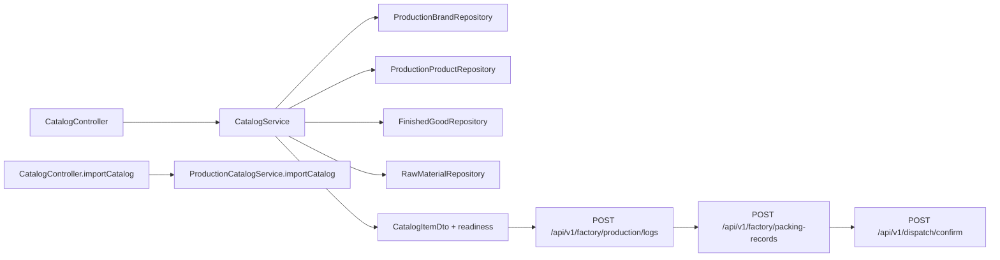

# Catalog, SKU, and Item Flows

Current-state cleanup brief:

- [../catalog-consolidation/README.md](../catalog-consolidation/README.md)
- [../catalog-consolidation/01-current-state-flow.md](../catalog-consolidation/01-current-state-flow.md)
- [../catalog-consolidation/02-target-accounting-product-entry-flow.md](../catalog-consolidation/02-target-accounting-product-entry-flow.md)
- [../catalog-consolidation/03-definition-of-done-and-parallel-scope.md](../catalog-consolidation/03-definition-of-done-and-parallel-scope.md)
- [../catalog-consolidation/04-update-hygiene.md](../catalog-consolidation/04-update-hygiene.md)

## Folder Map

- `modules/production/controller`
  Purpose for this slice: canonical brand and item setup/readiness host.
- `modules/production/service`
  Purpose for this slice: canonical item persistence, readiness-aware reads, and adjunct import orchestration.
- `modules/production/domain`
  Purpose for this slice: brand, item, and import persistence.
- `modules/inventory/domain`
  Purpose for this slice: finished-good and raw-material mirrors kept in sync with item truth.
- `modules/factory/controller`
  Purpose for this slice: canonical batch and pack execution after setup is complete.
- `modules/sales/controller`
  Purpose for this slice: canonical factory-owned dispatch confirm after packing.

## Canonical Workflow Graph

## Major Workflows

### Brand and item maintenance

- entry:
  - `GET/POST /api/v1/catalog/brands`
  - `GET/POST /api/v1/catalog/items`
  - `GET/PUT/DELETE /api/v1/catalog/items/{itemId}`
- canonical path:
  - `CatalogController`
  - `CatalogService`
  - downstream finished-good and raw-material mirror alignment
- why it matters:
  - this is the only supported public stock-bearing setup host
  - readiness is exposed on the same host the operator uses for setup

### Catalog import adjunct

- entry: `POST /api/v1/catalog/import`
- canonical path:
  - `CatalogController.importCatalog`
  - `ProductionCatalogService.importCatalog`
- what it does:
  - processes import files
  - lands data that must still be visible through `/api/v1/catalog/items`
- why it matters:
  - import is an adjunct provisioning path, not a competing public setup host

### Downstream operator handoff

- setup truth:
  - `/api/v1/catalog/items`
- execution truth:
  - `POST /api/v1/factory/production/logs`
  - `POST /api/v1/factory/packing-records`
  - `POST /api/v1/dispatch/confirm`
- why it matters:
  - accounting-facing docs should describe one item -> batch -> pack -> dispatch story

## What Works

- one public setup host owns stock-bearing item truth and readiness
- finished-good and raw-material mirrors are aligned off the same canonical item surface
- factory execution and factory dispatch now read like one coherent downstream path from setup
- dispatch posting is explicitly sales-owned rather than split across factory and sales surfaces

## Duplicates and Bad Paths

- retired stock-bearing setup hosts must stay retired:
  - `legacy product routes`
  - `legacy accounting-prefixed product setup routes`
- retired execution hosts must stay retired:
  - `/api/v1/factory/production-batches`
  - `/api/v1/factory/pack`
  - `/api/v1/dispatch/confirm`
- `/api/v1/dispatch/**` is operational lookup only and must not be described as a second write surface

## Review Hotspots

- `CatalogController`
- `CatalogService`
- `ProductionCatalogService`
- `ProductionLogController`
- `PackingController`
- `DispatchController`
- `SalesController`
- `CatalogControllerCanonicalProductIT`
- `ProductionCatalogServiceCanonicalEntryTest`
- `DispatchOperationalBoundaryIT`
