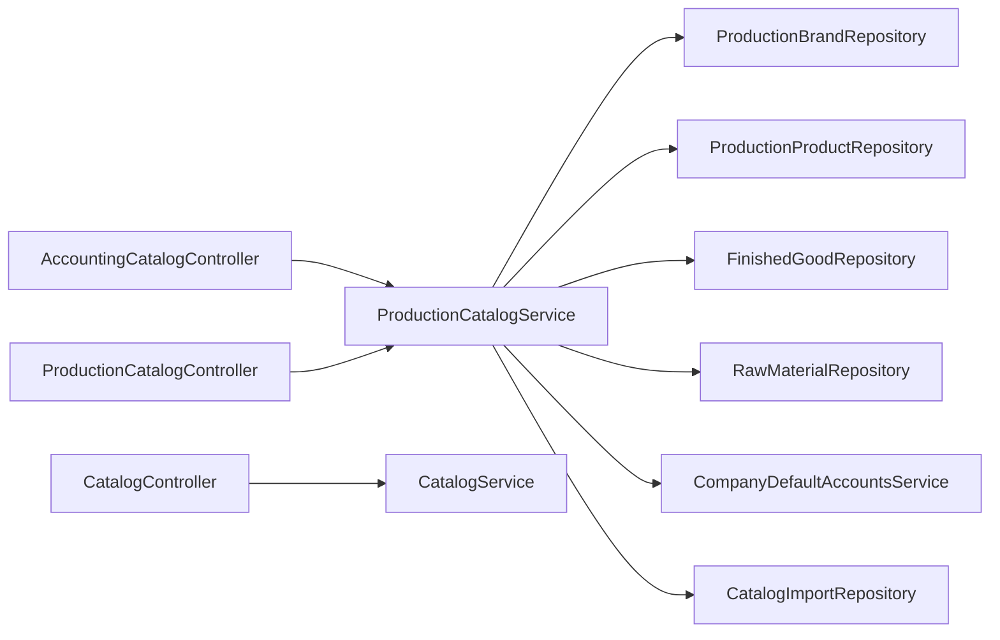

# Catalog, SKU, and Product Flows

Target-state cleanup brief:

- [../catalog-consolidation/README.md](../catalog-consolidation/README.md)
- [../catalog-consolidation/01-current-state-flow.md](../catalog-consolidation/01-current-state-flow.md)
- [../catalog-consolidation/02-target-accounting-product-entry-flow.md](../catalog-consolidation/02-target-accounting-product-entry-flow.md)
- [../catalog-consolidation/03-definition-of-done-and-parallel-scope.md](../catalog-consolidation/03-definition-of-done-and-parallel-scope.md)
- [../catalog-consolidation/04-update-hygiene.md](../catalog-consolidation/04-update-hygiene.md)

## Folder Map

- `modules/accounting/controller`
  Purpose for this slice: accounting-owned host for catalog import and product mutation routes.
- `modules/production/controller`
  Purpose for this slice: general catalog and production catalog read surfaces.
- `modules/production/service`
  Purpose for this slice: canonical product, brand, SKU, and variant orchestration.
- `modules/production/domain`
  Purpose for this slice: brand, product, and catalog-import persistence.
- `modules/inventory/domain`
  Purpose for this slice: finished-good and raw-material mirrors kept in sync with product truth.
- `modules/accounting/service`
  Purpose for this slice: default-account lookup used when finished goods need valuation / revenue / COGS metadata.

## Canonical Workflow Graph

## Major Workflows

### Catalog Import

- entry: `AccountingCatalogController.importCatalog`
- canonical path:
  - resolve `Idempotency-Key` or legacy header
  - `ProductionCatalogService.importCatalog`
  - `CatalogImportRepository`
  - per-row brand/product upsert and raw-material seeding
- key functions:
  - `importCatalog`
  - `processCatalogImport`
  - `upsertProduct`
- what it does:
  - validates CSV shape and content type
  - makes import idempotent per company
  - creates or updates brands and products
  - seeds raw materials and finished-good accounting metadata where needed

### Single Product Create

- entry: `AccountingCatalogController.createProduct`
- canonical path:
  - `ProductionCatalogService.createProduct`
  - normalize category
  - resolve or create brand
  - compute effective size label
  - `determineSku`
  - `ensureFinishedGoodAccounts`
  - save product
  - `ensureCatalogFinishedGood`
  - `syncRawMaterial`
- why it matters:
  - SKU generation and accounting metadata live together in the same service

### Bulk Variant Create

- entry: `AccountingCatalogController.createVariants`
- canonical path:
  - `ProductionCatalogService.createVariants`
  - `prepareVariantExecutionPlan`
  - detect duplicate-in-request and existing-SKU conflicts
  - on commit, call `createProduct` for each candidate
- key functions:
  - `createVariants`
  - `prepareVariantExecutionPlan`
  - `resolveBrandPlanForVariantPlanning`
  - `requireVariantSkuFragment`
- why it matters:
  - this is the explicit matrix path for color/size bulk SKU generation

### Product Update

- entry: `AccountingCatalogController.updateProduct`
- canonical path:
  - `ProductionCatalogService.updateProduct`
  - mutate only provided fields
  - re-run `ensureFinishedGoodAccounts` when product remains a finished good
  - `ensureCatalogFinishedGood`
- key constraint:
  - import path refuses SKU changes for existing products

## What Works

- one service owns SKU generation, brand resolution, product persistence, and accounting metadata backfill
- finished-good products get default accounting accounts injected instead of relying on manual downstream fixes
- catalog import is company-scoped and strongly idempotent
- bulk variant creation already fail-closes on duplicate or concurrent SKU conflicts

## Duplicates and Bad Paths

- catalog surfaces are split across three hosts:
  - `AccountingCatalogController` for write-heavy accounting/admin use
  - `CatalogController` for broader general catalog CRUD
  - `ProductionCatalogController` for read-only brand/product listing
- `AccountingCatalogController.listProducts` and `/api/v1/catalog/products` both surface product truth from different controller families
- accounting route ownership is only a wrapper; the actual truth lives in production services and inventory mirrors
- raw-material management still lives on inventory routes such as `/api/v1/catalog/products`, which means product/catalog truth is not fully consolidated behind one host

## Review Hotspots

- `ProductionCatalogService.createProduct`
- `ProductionCatalogService.createVariants`
- `ProductionCatalogService.updateProduct`
- `ProductionCatalogService.ensureFinishedGoodAccounts`
- `ProductionCatalogService.upsertProduct`
- `AccountingCatalogController`
- `CatalogController`
- `AccountingCatalogControllerSecurityIT`
- `TS_CatalogImportCompanyScopedIdempotencyTest`
