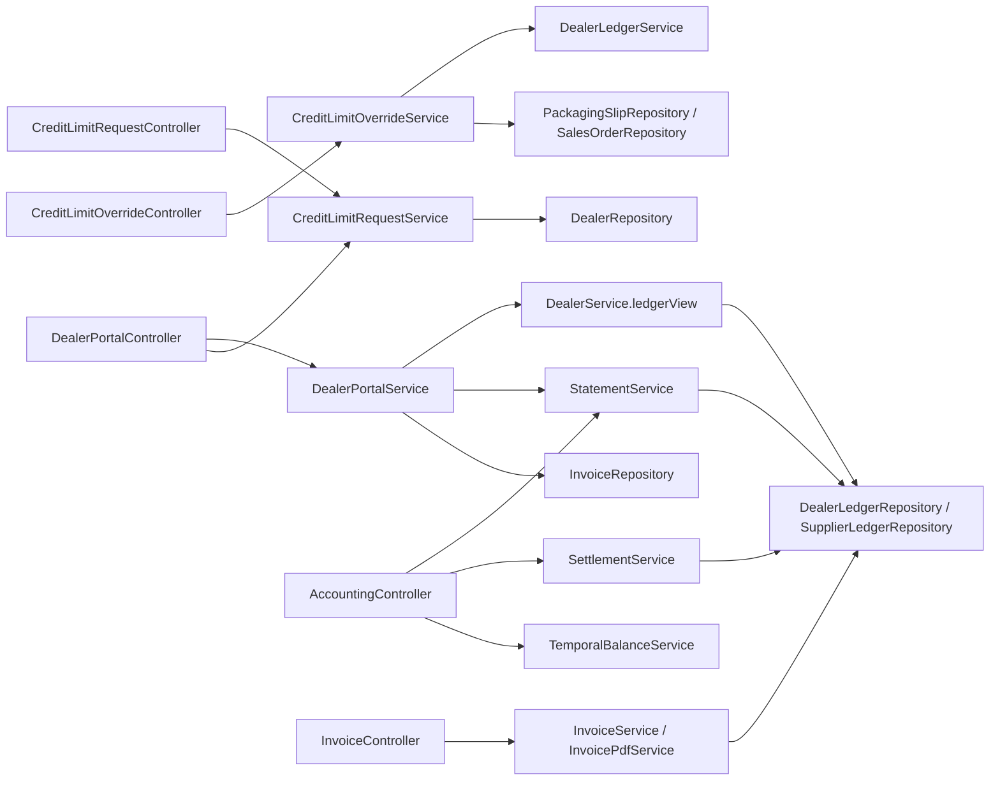

# Credit, Ledger, and Customer-Facing Accounting Flows

## Folder Map

- `modules/sales/controller`
  Purpose for this slice: dealer portal, dealer admin views, credit requests, and credit override routes.
- `modules/sales/service`
  Purpose for this slice: dealer ledger views, credit approvals, dispatch override checks, and dealer self-service reads.
- `modules/accounting/controller`
  Purpose for this slice: statement, aging, settlement, and supplier/dealer accounting actions.
- `modules/accounting/service`
  Purpose for this slice: ledger-backed statements, settlements, and temporal balance helpers.
- `modules/invoice/controller`
  Purpose for this slice: invoice read, export, and email surfaces over receivable truth.

## Canonical Workflow Graph

## Major Workflows

### Credit Request Pipeline

- entry:
  - `CreditLimitRequestController.listRequests`
  - `CreditLimitRequestController.createRequest`
  - `CreditLimitRequestController.approveRequest`
  - `CreditLimitRequestController.rejectRequest`
  - `DealerPortalController.createCreditLimitRequest`
- canonical path:
  - `CreditLimitRequestService`
  - `CreditRequestRepository`
  - on approval, mutate the dealer credit limit directly
- key functions:
  - `listRequests`
  - `createRequest`
  - `approveRequest`
  - `rejectRequest`
- important semantic:
  - this is the durable credit-limit mutation path, and create always starts at `PENDING` with no edit route

### Credit Override Pipeline

- entry:
  - `CreditLimitOverrideController.createRequest`
  - `listRequests`
  - `approveRequest`
  - `rejectRequest`
- canonical path:
  - `CreditLimitOverrideService`
  - current dealer exposure via `DealerLedgerService`
  - packaging slip or sales order context
  - maker-checker approval metadata
- important semantic:
  - this authorizes temporary dispatch headroom over current credit exposure

### Dealer Portal Ledger / Aging / Invoices

- entry:
  - `DealerPortalController.getDashboard`
  - `getMyLedger`
  - `getMyInvoices`
  - `getMyAging`
  - `getMyInvoicePdf`
- canonical path:
  - `DealerPortalService`
  - `DealerService.ledgerView`
  - `StatementService.dealerAging`
  - invoice repository reads
  - PDF rendering for invoice export
- important semantic:
  - portal balance/aging uses ledger-backed truth, while pending-order exposure is shown separately as forward-looking usage

### Accounting Statement / Aging / Settlement

- entry:
  - `AccountingController.dealerStatement`
  - `supplierStatement`
  - `dealerAging`
  - `supplierAging`
  - `settleDealerInvoices`
  - `settleSupplierInvoices`
  - `autoSettleDealer`
  - `autoSettleSupplier`
- canonical path:
  - `StatementService`
  - `SettlementService`
  - `DealerLedgerRepository` / `SupplierLedgerRepository`
- important semantic:
  - these are ledger-backed accounting helpers, not the canonical public report namespace

## What Works

- credit requests and override requests are explicit separate workflows rather than one overloaded endpoint
- dealer ledger truth is reused across dealer portal, dealer admin, and accounting views
- dealer portal creates durable credit-limit requests on the same canonical workflow used by sales/admin
- invoice export and email routes do not invent their own receivable truth

## Duplicates and Bad Paths

- there are two approval pipelines around dealer credit:
  - `CreditRequest`
  - `CreditLimitOverrideRequest`
- dealer-facing ledger and aging truth is surfaced through multiple hosts:
  - `DealerPortalController`
  - `DealerController`
  - `AccountingController`
  - `ReportController`
- `ReportService.accountStatement` is not the same thing as `StatementService.dealerStatement`, even though the names sound similar
- dealer-facing credit state is split across durable limit changes and temporary dispatch overrides, so UI copy must keep those semantics separate

## Review Hotspots

- `CreditLimitRequestService.createRequest`
- `CreditLimitRequestService.approveRequest`
- `CreditLimitOverrideService.createRequest`
- `CreditLimitOverrideService.approveRequest`
- `DealerPortalService.buildAgingView`
- `StatementService.dealerStatement`
- `StatementService.supplierStatement`
- `SettlementService`
