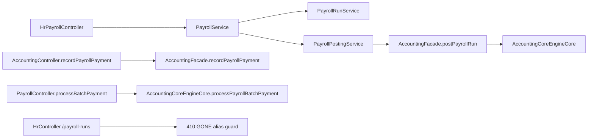

# Payroll and HR Overlap

## Folder Map

- `modules/hr/controller`
  Purpose for this slice: canonical payroll run lifecycle plus a retired alias surface on `HrController`.
- `modules/hr/service`
  Purpose for this slice: payroll creation, calculation, approval, accounting posting, payment finalization, and legacy guardrails.
- `modules/hr/domain`
  Purpose for this slice: payroll run and payroll run line truth, including journal linkage.
- `modules/accounting/controller`
  Purpose for this slice: accounting-owned payroll payment and batch-payment entrypoints.
- `modules/accounting/internal`
  Purpose for this slice: actual payroll journal and payment posting logic.

## Canonical Workflow Graph

## Major Workflows

### Canonical Payroll Run Lifecycle

- entry:
  - `HrPayrollController.createPayrollRun`
  - `calculatePayroll`
  - `approvePayroll`
  - `postPayroll`
  - `markAsPaid`
- canonical path:
  - `PayrollService`
  - `PayrollRunService`
  - `PayrollPostingService`
- key functions:
  - `PayrollPostingService.postPayrollToAccounting`
  - `PayrollPostingService.markAsPaid`
- important semantic:
  - HR owns the run lifecycle and accounting journal linkage

### Accounting Posting

- entry: `HrPayrollController.postPayroll`
- canonical path:
  - `PayrollPostingService.postPayrollToAccounting`
  - resolve payable and expense accounts
  - create standardized journal lines
  - `AccountingFacade.postPayrollRun`
  - store journal link on `PayrollRun`
- what it guarantees:
  - a posted payroll run cannot exist without the posting journal link

### Payroll Payment

- entry:
  - `AccountingController.recordPayrollPayment`
  - `PayrollController.processBatchPayment`
- canonical path:
  - record payment against posted payroll journal
  - or process accounting-side batch payment directly
- key distinction:
  - `recordPayrollPayment` is the canonical journal payment path
  - `processPayrollBatchPayment` is a narrower accounting shortcut

### Legacy Alias Behavior

- entry:
  - `HrController.payrollRuns`
  - `HrController.createPayrollRun`
  - deprecated `HrService.createPayrollRun`
- current behavior:
  - fail closed with `410 GONE`
  - point callers to `/api/v1/payroll/runs`

## What Works

- payroll posting is not free-floating; it lands in accounting through `AccountingFacade`
- `PayrollPostingService` already enforces journal-link invariants
- legacy HR payroll-run aliases are explicitly retired, not silently forwarded

## Duplicates and Bad Paths

- HR owns canonical payroll lifecycle, but accounting still exposes `PayrollController.processBatchPayment`
- module ownership is path-sensitive:
  - `/api/v1/payroll/**` is `HR_PAYROLL`
  - `/api/v1/accounting/payroll/**` is treated as `ACCOUNTING`
- `HrService.createPayrollRun` still exists only to throw a legacy-deprecated exception
- final paid-state updates happen in HR after payment journal creation, so batch accounting shortcuts can feel like they bypass richer HR-side finalization

## Review Hotspots

- `HrPayrollController`
- `HrController.legacyPayrollRunsGone`
- `PayrollPostingService.postPayrollToAccounting`
- `PayrollPostingService.markAsPaid`
- `PayrollController.processBatchPayment`
- `AccountingCoreEngineCore.processPayrollBatchPayment`
- `AccountingFacade.postPayrollRun`
