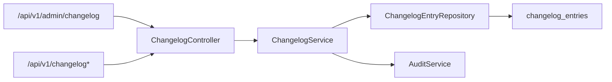

# Changelog Governance Flow

## Folder Map

- `modules/admin/controller`
  Purpose for this slice: admin write routes and public changelog read routes.
- `modules/admin/service`
  Purpose for this slice: changelog lifecycle logic and audit emission.
- `modules/admin/domain`
  Purpose for this slice: `ChangelogEntry` persistence and repository queries.
- `core/security`
  Purpose for this slice: public read admission and admin-only mutation protection.

## Canonical Workflow Graph

## Major Workflows

### Admin Publish / Update / Delete

- entry:
  - `ChangelogController.create`
  - `ChangelogController.update`
  - `ChangelogController.delete`
- canonical path:
  - `ChangelogService.create`
  - `update`
  - `softDelete`
  - `ChangelogEntryRepository`
  - `AuditService.logAuthSuccess`
- key methods:
  - `applyRequest`
  - `requireEntry`
  - `toResponse`
- important semantic:
  - delete is soft delete only

### Public Feed and Highlight

- entry:
  - `ChangelogController.list`
  - `ChangelogController.latestHighlighted`
- canonical path:
  - `ChangelogService.list`
  - `latestHighlighted`
  - repository reads filtered by `deleted = false`
- important semantic:
  - this is global public product messaging, not tenant-scoped accounting truth

## What Works

- security split is explicit:
  - public feed reads
  - admin / super-admin writes
- the service filters out deleted entries instead of physically deleting rows
- latest highlighted feed is a direct dedicated query instead of client-side filtering

## Duplicates and Bad Paths

- changelog is adjacent to ERP workflows but not actually part of accounting truth ownership
- the surface is intentionally split:
  - public `/api/v1/changelog*`
  - admin `/api/v1/admin/changelog*`
- docs and contracts can drift on delete semantics because the controller returns `204 No Content`
- the table is global, not per tenant, so any future tenant-specific changelog would be a real schema change

## Review Hotspots

- `ChangelogController.create`
- `ChangelogController.delete`
- `ChangelogService.create`
- `ChangelogService.softDelete`
- `ChangelogService.latestHighlighted`
- `ChangelogEntry`
- `SecurityConfig.securityFilterChain`
