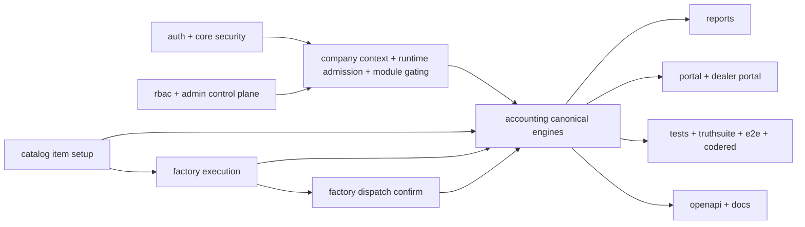

# Accounting Cross-Module Workflow Map

This folder documents how the ERP reaches accounting truth across modules after the ERP-38 hard-cut.

Scope:

- folder-by-folder ownership
- workflow-significant controllers, services, entities, DTOs, and key methods
- canonical write/read paths into accounting
- duplicates, bad paths, stale seams, and review hotspots

## System Graph

## Canonical Truth Rules

- stock-bearing setup truth converges on `/api/v1/catalog/items`
- production truth converges on `POST /api/v1/factory/production/logs`
- packing truth converges on `POST /api/v1/factory/packing-records`
- dispatch posting truth converges on factory confirmation at `POST /api/v1/dispatch/confirm`
- `/api/v1/dispatch/**` remains a read-only operational lookup surface
- accounting remains the posting sink rather than a second stock-bearing setup workspace

## Highest-Value Current Findings

- sales, purchasing, inventory, factory, and HR all write accounting through narrower choke points than older packet docs assumed
- stock-bearing setup no longer needs `legacy product routes` or `legacy accounting-prefixed product setup routes` to explain downstream accounting readiness
- production and packing are now the only execution writes that can turn ready setup into dispatchable stock before sales confirms shipment
- outward accounting workflows should describe the canonical item -> batch -> pack -> dispatch story rather than a split catalog-host story

## Doc Index

- [../catalog-consolidation/README.md](../catalog-consolidation/README.md)
- [00-accounting-module-map.md](./00-accounting-module-map.md)
- [01-accounting-internals.md](./01-accounting-internals.md)
- [02-sales-boundary.md](./02-sales-boundary.md)
- [03-purchasing-boundary.md](./03-purchasing-boundary.md)
- [04-inventory-boundary.md](./04-inventory-boundary.md)
- [05-factory-production-boundary.md](./05-factory-production-boundary.md)
- [06-hr-payroll-bridge.md](./06-hr-payroll-bridge.md)
- [07-reports-truth-sources.md](./07-reports-truth-sources.md)
- [08-period-close-reconciliation.md](./08-period-close-reconciliation.md)
- [09-runtime-gating-control-plane.md](./09-runtime-gating-control-plane.md)
- [10-imports-config-adjuncts.md](./10-imports-config-adjuncts.md)
- [11-tests-docs-openapi-truth.md](./11-tests-docs-openapi-truth.md)
- [12-accounting-outward-flow-map.md](./12-accounting-outward-flow-map.md)
- [13-catalog-sku-and-product-flows.md](./13-catalog-sku-and-product-flows.md)
- [14-credit-ledger-and-customer-flows.md](./14-credit-ledger-and-customer-flows.md)
- [15-payroll-hr-overlap.md](./15-payroll-hr-overlap.md)
- [16-changelog-governance-flow.md](./16-changelog-governance-flow.md)

## Fast Review Order

1. `../catalog-consolidation/README.md`
2. `13-catalog-sku-and-product-flows.md`
3. `05-factory-production-boundary.md`
4. `02-sales-boundary.md`
5. `04-inventory-boundary.md`
6. `01-accounting-internals.md`
7. `08-period-close-reconciliation.md`
8. `07-reports-truth-sources.md`
9. `10-imports-config-adjuncts.md`
10. `11-tests-docs-openapi-truth.md`
