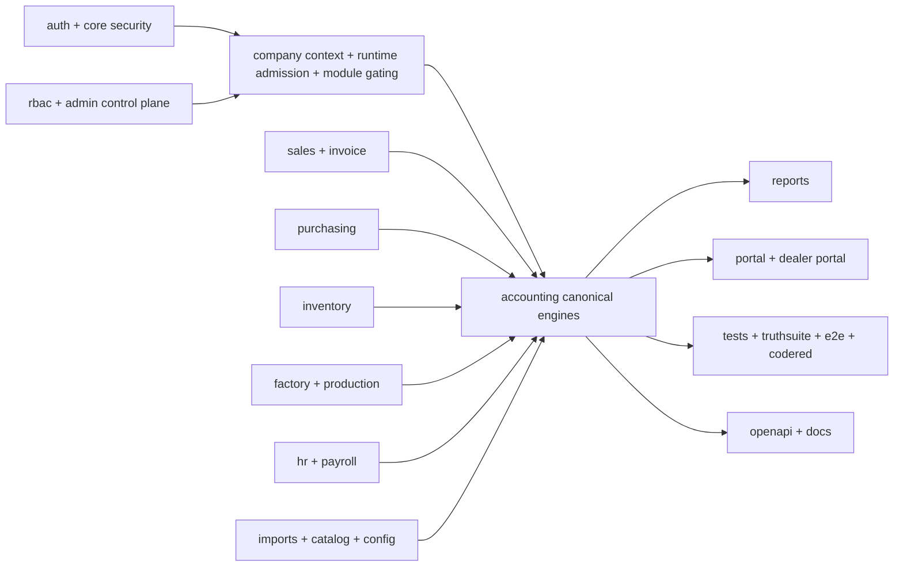

# Accounting Cross-Module Workflow Map

Branch truth:
- worktree: `bigbrightpaints-erp_worktrees/erp-stabilization-program/erp-20-report-controller-fix`
- branch: `feature/erp-stabilization-program--erp-20--report-controller-review-fix`
- head: `6f688e3c3305575ca1d8931549fde5d77913e8f6`

This folder documents how the ERP reaches accounting truth across modules.

Scope:
- folder-by-folder ownership
- workflow-significant controllers, services, entities, DTOs, and key methods
- canonical write/read paths into accounting
- duplicates, bad paths, stale seams, and review hotspots

Depth rule:
- this is exhaustive for folders and workflow-significant entry/orchestration methods
- it is intentionally not a dump of every private helper method in every file

## System Graph

## Canonical Truth Rules

- write truth should converge in `modules/accounting/internal/AccountingCoreEngineCore`
- period-close truth should converge in `modules/accounting/internal/AccountingPeriodServiceCore`
- reconciliation truth should converge in `modules/accounting/internal/ReconciliationServiceCore`
- public financial report truth should surface from `/api/v1/reports/**`
- tenant access truth should converge in `CompanyContextFilter`, `ModuleGatingInterceptor`, and tenant runtime policy

## Highest-Value Current Findings

- accounting still has wrapper duplication around the canonical engines
- sales, purchasing, inventory, factory, and HR all write accounting through narrow choke points, but some modules still duplicate orchestration before reaching those choke points
- report canonicalization is done, but report internals are still inconsistent, especially cash flow
- payroll, settlement, and journal families still have parallel or legacy-leaning paths
- control-plane drift can present as accounting bugs because gating and runtime admission are layered
- outward accounting workflows are split across three catalog hosts, two credit-approval pipelines, duplicated dealer-ledger views, and a separate global changelog governance surface

## Doc Index

- [../catalog-consolidation/README.md](../catalog-consolidation/README.md)
- [00-accounting-module-map.md](./00-accounting-module-map.md)
- [01-accounting-internals.md](./01-accounting-internals.md)
- [02-sales-boundary.md](./02-sales-boundary.md)
- [03-purchasing-boundary.md](./03-purchasing-boundary.md)
- [04-inventory-boundary.md](./04-inventory-boundary.md)
- [05-factory-production-boundary.md](./05-factory-production-boundary.md)
- [06-hr-payroll-bridge.md](./06-hr-payroll-bridge.md)
- [07-reports-truth-sources.md](./07-reports-truth-sources.md)
- [08-period-close-reconciliation.md](./08-period-close-reconciliation.md)
- [09-runtime-gating-control-plane.md](./09-runtime-gating-control-plane.md)
- [10-imports-config-adjuncts.md](./10-imports-config-adjuncts.md)
- [11-tests-docs-openapi-truth.md](./11-tests-docs-openapi-truth.md)
- [12-accounting-outward-flow-map.md](./12-accounting-outward-flow-map.md)
- [13-catalog-sku-and-product-flows.md](./13-catalog-sku-and-product-flows.md)
- [14-credit-ledger-and-customer-flows.md](./14-credit-ledger-and-customer-flows.md)
- [15-payroll-hr-overlap.md](./15-payroll-hr-overlap.md)
- [16-changelog-governance-flow.md](./16-changelog-governance-flow.md)

## Fast Review Order

1. `../catalog-consolidation/README.md`
2. `01-accounting-internals.md`
3. `08-period-close-reconciliation.md`
4. `07-reports-truth-sources.md`
5. `02-sales-boundary.md`
6. `03-purchasing-boundary.md`
7. `04-inventory-boundary.md`
8. `05-factory-production-boundary.md`
9. `06-hr-payroll-bridge.md`
10. `09-runtime-gating-control-plane.md`
11. `10-imports-config-adjuncts.md`
12. `11-tests-docs-openapi-truth.md`
13. `12-accounting-outward-flow-map.md`
14. `13-catalog-sku-and-product-flows.md`
15. `14-credit-ledger-and-customer-flows.md`
16. `15-payroll-hr-overlap.md`
17. `16-changelog-governance-flow.md`
