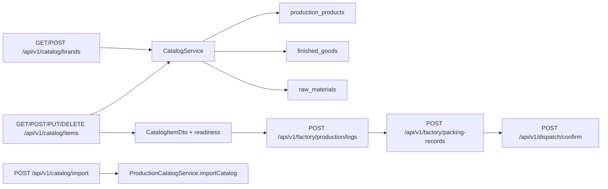

# Catalog Current-State Flow Map

This document describes the current live catalog setup flow after ERP-38 hard-cut cleanup.
It should stay factual and code-grounded.

## Current Public Surface

### Canonical host: `/api/v1/catalog/**`

Public stock-bearing setup now converges on `modules/production/controller/CatalogController`.

Supported operator-facing setup operations:

- `GET /api/v1/catalog/brands?active=true`
- `POST /api/v1/catalog/brands`
- `GET /api/v1/catalog/items`
- `GET /api/v1/catalog/items/{itemId}`
- `POST /api/v1/catalog/items`
- `PUT /api/v1/catalog/items/{itemId}`
- `DELETE /api/v1/catalog/items/{itemId}`

Adjunct import still exists on `POST /api/v1/catalog/import`, but it is not the stock-bearing operator setup host. Imported rows must still reconcile back to the same item and readiness truth exposed on `/api/v1/catalog/items`.

No alternate public stock-bearing setup host remains.

## System Graph

## Controller And Service Map

### `CatalogController`

- brand CRUD delegates to `CatalogService`
- item create/read/update/deactivate delegates to `CatalogService`
- catalog import delegates to `ProductionCatalogService.importCatalog(...)`
- readiness visibility is exposed on item list/detail reads through `includeReadiness=true`

### `CatalogService`

- owns brand create/list/get/update/deactivate
- owns stock-bearing item create/read/update/deactivate
- owns readiness-aware browse/detail DTO mapping for `/api/v1/catalog/items`
- keeps finished-good and raw-material mirrors aligned with setup writes

### `ProductionCatalogService`

- owns catalog import processing only
- is an adjunct provisioning path, not the primary operator setup host
- must still land rows that are discoverable and readiness-aware through `/api/v1/catalog/items`

## Persistence Truth

### `production_products`

- canonical catalog master rows backing item identity
- supports tenant-local brand linkage, stable `variantGroupId` / `productFamilyName` family grouping, item-class semantics, and factory-facing selection

### `finished_goods`

- finished-good inventory truth for sellable/manufacturable items
- feeds packing outputs and later dispatchable stock

### `raw_materials`

- raw-material inventory truth for production inputs and packaging materials
- feeds production-log consumption and packaging setup validation

## End-To-End Current Flows

### 1. Existing-brand item entry

1. UI fetches selectable brands from `GET /api/v1/catalog/brands?active=true`
2. UI submits `POST /api/v1/catalog/items` with an active `brandId`
3. `CatalogService` validates the request and persists stock-bearing item truth plus downstream mirrors
4. `GET /api/v1/catalog/items?includeReadiness=true` returns the created item with brand, family/variant linkage, pricing, stock-gated enrichment, and readiness context

### 2. New-brand item entry

1. UI creates the brand on `POST /api/v1/catalog/brands`
2. UI uses the returned `brandId` in `POST /api/v1/catalog/items`
3. Item detail reads on `GET /api/v1/catalog/items/{itemId}?includeReadiness=true` become the canonical pre-execution readiness surface

### 3. Optional import adjunct

1. Bulk import enters on `POST /api/v1/catalog/import`
2. `ProductionCatalogService.importCatalog(...)` processes the file
3. Imported rows are still expected to surface through `/api/v1/catalog/items` rather than through a separate public setup host

### 4. Downstream operator handoff

- ready raw-material items flow into `POST /api/v1/factory/production/logs`
- packed sellable output flows through `POST /api/v1/factory/packing-records`
- final dispatch posting happens only on `POST /api/v1/dispatch/confirm`
- `/api/v1/dispatch/**` stays read-only for prepared-slip lookup and redacted factory views

## Review Hotspots

- `modules/production/controller/CatalogController`
- `modules/production/service/CatalogService`
- `modules/production/service/ProductionCatalogService`
- `modules/production/dto/CatalogItemRequest`
- `modules/production/dto/CatalogItemDto`
- `modules/factory/controller/ProductionLogController`
- `modules/factory/controller/PackingController`
- `modules/inventory/controller/DispatchController`
- `modules/sales/controller/SalesController`
