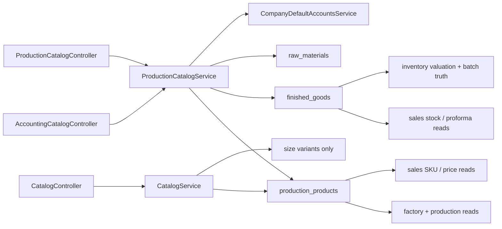

# Catalog Current-State Flow Map

This document records the current live catalog and SKU flow before the
consolidation packet starts. It is intentionally factual and code-grounded.

## Purpose

Use this file when you need to understand:

- which controller host a user is currently hitting
- which service actually owns the write or read behavior
- where product truth is persisted
- how product creation reaches inventory, production, sales, and costing
- where duplicate or confusing paths exist today

## System Graph

## Public Hosts

### `/api/v1/accounting/catalog/**`

- controller: `modules/accounting/controller/AccountingCatalogController`
- purpose:
  - catalog import
  - list products
  - create product
  - create bulk variants
  - update product
- backing service: `ProductionCatalogService`
- important behavior:
  - this is the most operationally complete create path today
  - it mirrors finished goods and raw materials after product create

### `/api/v1/catalog/**`

- controller: `modules/production/controller/CatalogController`
- purpose:
  - brand CRUD
  - product CRUD
  - product search
  - bulk upsert
- backing service: `CatalogService`
- important behavior:
  - this is already the cleanest public host shape
  - but its write path is weaker than the accounting catalog path
  - it writes `production_products` and syncs size variants, but does not
    guarantee the same inventory mirror readiness

### `/api/v1/production/**`

- controller: `modules/production/controller/ProductionCatalogController`
- purpose:
  - list brands
  - list products by brand
- backing service: `ProductionCatalogService`
- important behavior:
  - read-only browse host
  - duplicates browse responsibility already covered by `/api/v1/catalog/**`

## Controller and Service Map

### `AccountingCatalogController`

- `importCatalog`
  - multipart CSV import
  - resolves `Idempotency-Key` or legacy `X-Idempotency-Key`
  - delegates to `ProductionCatalogService.importCatalog`
- `listProducts`
  - delegates to `ProductionCatalogService.listProducts`
- `createProduct`
  - delegates to `ProductionCatalogService.createProduct`
- `createVariants`
  - delegates to `ProductionCatalogService.createVariants`
  - supports `dryRun=true` preview
- `updateProduct`
  - delegates to `ProductionCatalogService.updateProduct`

### `CatalogController`

- `createBrand`
  - delegates to `CatalogService.createBrand`
- `listBrands`, `getBrand`, `updateBrand`, `deactivateBrand`
  - brand CRUD surface
- `createProduct`
  - delegates to `CatalogService.createProduct`
- `searchProducts`, `getProduct`, `updateProduct`, `deactivateProduct`
  - product browse and CRUD
- `bulkUpsertProducts`
  - delegates to `CatalogService.bulkUpsertProducts`

### `ProductionCatalogController`

- `listBrands`
  - delegates to `ProductionCatalogService.listBrands`
- `listBrandProducts`
  - delegates to `ProductionCatalogService.listBrandProducts`

### `ProductionCatalogService`

Workflow-significant methods:

- `createProduct`
  - resolves or creates brand
  - normalizes category
  - resolves size label
  - computes SKU through `determineSku`
  - injects finished-good accounts through `ensureFinishedGoodAccounts`
  - saves `ProductionProduct`
  - mirrors to inventory through `ensureCatalogFinishedGood`
  - mirrors raw materials through `syncRawMaterial`
- `createVariants`
  - builds a matrix plan
  - detects conflicts
  - optionally previews with `dryRun`
  - commits by calling `createProduct` for each candidate
- `importCatalog`
  - idempotent company-scoped import
  - upserts brands/products and seeds downstream mirrors
- `listBrands`, `listBrandProducts`, `listProducts`
  - browse support for accounting/production surfaces
- `updateProduct`
  - updates product truth and re-runs mirror/account readiness where needed

### `CatalogService`

Workflow-significant methods:

- `createBrand`
  - canonical brand create under `/api/v1/catalog/brands`
- `createProduct`
  - saves `ProductionProduct`
  - generates SKU through `generateSku`
  - syncs size variants
  - does not create finished-good or raw-material mirrors
- `searchProducts`
  - search/page over `production_products`
- `updateProduct`
  - updates `ProductionProduct`
  - syncs size variants
- `bulkUpsertProducts`
  - multi-item mutation surface over the same lightweight write path

## Persistence Truth

### `production_products`

- entity: `modules/production/domain/ProductionProduct`
- role:
  - canonical product master row
  - holds brand, category, name, SKU, size, color, unit, price, GST, and
    product metadata
- important limitation:
  - current model does not contain an explicit persistent product-family or
    variant-group link

### `finished_goods`

- entity: `modules/inventory/domain/FinishedGood`
- role:
  - inventory-facing finished-good mirror
  - holds stock, costing method, valuation/COGS/revenue/discount/tax accounts
- operational significance:
  - sales stock readiness and production batch flows depend on this mirror, not
    just on `production_products`

### `raw_materials`

- role:
  - inventory-facing raw-material mirror
- operational significance:
  - raw-material create must land here to be usable in inventory/material issue
    flows

## End-To-End Current Flows

### 1. Accounting Catalog Create

1. request enters `AccountingCatalogController.createProduct`
2. `ProductionCatalogService.createProduct` resolves brand and product fields
3. `ProductionProduct` is saved
4. `ensureCatalogFinishedGood` creates or updates the finished-good mirror when
   category is sellable/manufacturable
5. `syncRawMaterial` creates or updates raw-material mirror when category is a
   raw material

Result:

- accounting can see the product
- inventory mirror exists
- downstream production and sales are more likely to work without manual repair

### 2. General Catalog Create

1. request enters `CatalogController.createProduct`
2. `CatalogService.createProduct` validates brand and payload
3. `ProductionProduct` is saved
4. size variants are synced

Result:

- product master exists
- browse/search can show the product
- but downstream finished-good or raw-material mirrors are not guaranteed

### 3. Production Browse / Manufacturing Selection

Production-side product browsing uses:

- `ProductionCatalogController.listBrands`
- `ProductionCatalogController.listBrandProducts`

Factory execution later relies on:

- `ProductionLogService.createLog`
  - requires `brandId` and `productId`
  - validates brand/product relationship
  - registers semi-finished batch and inventory movement

Implication:

- production can select products from the master table
- but operational inventory execution still depends on mirror/batch truth

### 4. Sales Search / Order / Availability

Sales browse/search can see product truth through catalog reads, but actual
order execution does more:

- `SalesCoreEngine.resolveOrderItems`
  - loads `ProductionProduct` by SKU
  - then requires `FinishedGood` by the same SKU
  - fails if the finished-good mirror does not exist
- `SalesProformaBoundaryService.assessCommercialAvailability`
  - loads `FinishedGood`
  - then checks available batches

Implication:

- browse visibility is not enough
- sellability requires both product master truth and inventory mirror truth

### 5. Costing / Valuation

- dispatch and stock valuation rely on inventory batches and finished-good
  truth, not only on the product master row
- this is why catalog creation cannot stop at `production_products`

## What Works Today

- the accounting catalog path already captures the stronger downstream-ready
  behavior
- brand create/search already has a clean canonical host under `/api/v1/catalog`
- sales price floor and tax defaults already read product master truth
- sales availability already fail-closes when stock truth is missing
- production/factory already uses product master plus inventory truth rather
  than inventing a second product table

## Duplicates and Confusing Paths

- three overlapping public hosts expose catalog/product truth
- two competing write engines create products with different side effects
- two SKU generation paths exist:
  - `ProductionCatalogService.determineSku`
  - `CatalogService.generateSku`
- one create path is downstream-ready and one is not
- there is no explicit variant family model yet, so grouped SKU intent is
  inferred rather than modeled

## Review Hotspots

- `modules/accounting/controller/AccountingCatalogController`
- `modules/production/controller/CatalogController`
- `modules/production/controller/ProductionCatalogController`
- `modules/production/service/ProductionCatalogService`
- `modules/production/service/CatalogService`
- `modules/production/domain/ProductionProduct`
- `modules/inventory/domain/FinishedGood`
- `modules/factory/service/ProductionLogService`
- `modules/sales/service/SalesCoreEngine`
- `modules/sales/service/SalesProformaBoundaryService`
