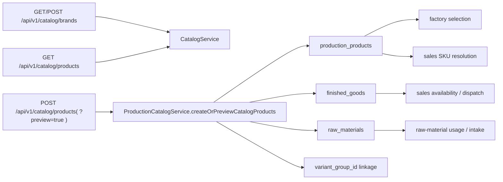

# Catalog Current-State Flow Map

This document describes the current live catalog flow after the consolidation
packet landed. It should stay factual and code-grounded.

## Current Public Surface

### Canonical host: `/api/v1/catalog/**`

Public catalog routes now live only on `modules/production/controller/CatalogController`.

Supported public operations:

- `GET /api/v1/catalog/brands?active=true`
- `POST /api/v1/catalog/brands`
- `GET /api/v1/catalog/products`
- `POST /api/v1/catalog/products`
- `POST /api/v1/catalog/products?preview=true`
- `GET/PUT/DELETE /api/v1/catalog/products/{productId}`

No alternate public catalog browse or write host remains.

## System Graph

## Controller And Service Map

### `CatalogController`

- brand CRUD delegates to `CatalogService`
- canonical product preview/commit delegates to
  `ProductionCatalogService.createOrPreviewCatalogProducts`
- browse/search and maintenance routes (`GET/PUT/DELETE /products`) delegate to
  `CatalogService`

### `CatalogService`

- owns brand create/list/get/update/deactivate
- owns catalog browse/search DTO mapping
- owns product maintenance for `GET/PUT/DELETE /api/v1/catalog/products/{id}`

### `ProductionCatalogService`

- owns canonical product preview and commit
- requires a pre-resolved active `brandId`
- rejects packed multi-value tokens inside `sizes[]` and `colors[]`
- computes the canonical SKU candidate set for preview and commit
- persists explicit `variantGroupId` linkage for grouped creates
- seeds finished-good or raw-material mirrors in the same write path

## Persistence Truth

### `production_products`

- canonical product master rows
- stores SKU/product identity plus explicit `variantGroupId`
- backs canonical browse/search and downstream brand/product selection

### `finished_goods`

- finished-good inventory truth for sellable/manufacturable members
- holds zero-stock defaults plus valuation/COGS/revenue/discount/tax readiness

### `raw_materials`

- raw-material inventory truth for raw-material members
- holds the inventory/account linkage needed by downstream material flows

## End-To-End Current Flows

### 1. Existing-brand product entry

1. UI fetches selectable brands from `GET /api/v1/catalog/brands?active=true`
2. UI submits `POST /api/v1/catalog/products` with an active `brandId`
3. `ProductionCatalogService` validates the request, plans SKU members, and
   persists product truth plus downstream mirrors
4. `GET /api/v1/catalog/products?brandId=...` returns the created members

### 2. New-brand product entry

1. UI creates the brand on `POST /api/v1/catalog/brands`
2. UI uses the returned `brandId` in `POST /api/v1/catalog/products`
3. Product preview/commit uses that same resolved `brandId` for preview and
   commit

### 3. Preview vs commit

1. `POST /api/v1/catalog/products?preview=true` returns candidate members,
   conflict diagnostics, downstream-effect counts, and the shared
   `variantGroupId`
2. Preview writes nothing
3. The same payload sent to `POST /api/v1/catalog/products` commits the same
   candidate set

### 4. Downstream readiness

- sales order resolution can use the SKU immediately after commit
- factory selection can use canonical brand/product identifiers from
  `/api/v1/catalog/products`
- finished-good and raw-material mirrors are seeded in the same write path

## Review Hotspots

- `modules/production/controller/CatalogController`
- `modules/production/service/CatalogService`
- `modules/production/service/ProductionCatalogService`
- `modules/production/dto/CatalogProductEntryRequest`
- `modules/production/dto/CatalogProductEntryResponse`
- `modules/production/domain/ProductionProduct`
- `modules/inventory/domain/FinishedGood`
- `modules/inventory/domain/RawMaterial`
- `modules/sales/service/SalesCoreEngine`
- `modules/factory/service/ProductionLogService`
