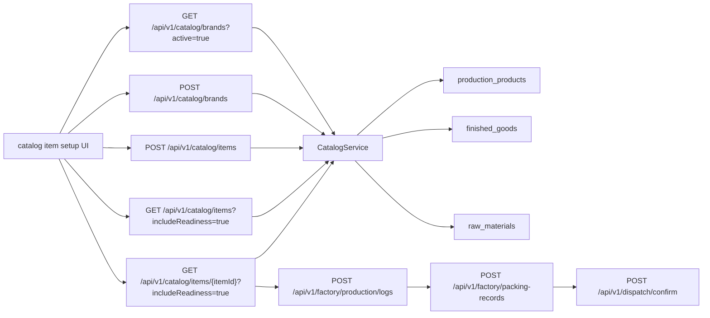

# Catalog Surface Consolidation

This folder is the developer packet for the surviving stock-bearing catalog setup contract.

## Purpose

Use this doc set to understand the current setup truth:

- the only supported public stock-bearing setup host is `/api/v1/catalog/items`
- brand selection and brand creation stay on `GET/POST /api/v1/catalog/brands`
- readiness stays visible on `GET /api/v1/catalog/items` and `GET /api/v1/catalog/items/{itemId}` with `includeReadiness=true`
- retired `legacy product routes` and `legacy accounting-prefixed product setup routes` setup hosts stay retired
- ready items flow into the canonical execution story: `POST /api/v1/factory/production/logs` -> `POST /api/v1/factory/packing-records` -> `POST /api/v1/dispatch/confirm`

## Doc Set

- [01-current-state-flow.md](./01-current-state-flow.md)
  Current runtime ownership for brands, items, readiness, and downstream execution handoff.
- [02-target-accounting-product-entry-flow.md](./02-target-accounting-product-entry-flow.md)
  Accounting-facing item-entry flow that matches the surviving runtime contract.
- [03-definition-of-done-and-parallel-scope.md](./03-definition-of-done-and-parallel-scope.md)
  Contract-level acceptance criteria for this packet.
- [04-update-hygiene.md](./04-update-hygiene.md)
  Files that must stay aligned when the setup contract changes.

## Surviving Public Contract

### Canonical brand flow

- `GET /api/v1/catalog/brands?active=true` for existing-brand selection
- `POST /api/v1/catalog/brands` for explicit new-brand creation

### Canonical item flow

- `GET /api/v1/catalog/items` for browse/search
- `GET /api/v1/catalog/items/{itemId}` for detail
- `POST /api/v1/catalog/items` for single-item create
- `PUT /api/v1/catalog/items/{itemId}` for item maintenance
- `DELETE /api/v1/catalog/items/{itemId}` for deactivation

### Rules

- item create/update requires a resolved active `brandId`
- `itemClass` is the supported setup input for distinguishing finished-good versus raw-material truth
- readiness reads must stay available before production, packing, or dispatch work begins
- do not reintroduce preview/commit or bulk product-create language under `legacy product routes`
- do not reintroduce accounting-prefixed catalog setup hosts for stock-bearing maintenance

## End-to-End Flow Summary

## What Must Stay True

- one public setup host for stock-bearing item work: `/api/v1/catalog/items`
- one explicit brand-create step when a new brand is needed
- one readiness-aware item read surface before factory execution
- one canonical operator execution story after setup: batch -> pack -> dispatch
- one checked-in OpenAPI snapshot at repo root (`openapi.json`) matching runtime
