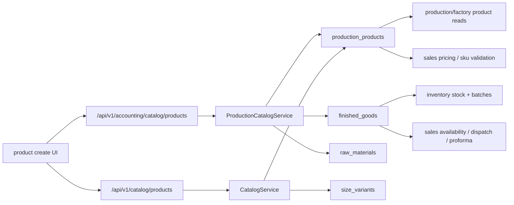

# Catalog Surface Consolidation

Branch truth:
- worktree: `bigbrightpaints-erp_worktrees/erp-stabilization-program/erp-20-report-controller-fix`
- branch: `feature/erp-stabilization-program--erp-20--report-controller-review-fix`
- head: `6f688e3c3305575ca1d8931549fde5d77913e8f6`

## Purpose

This folder is the developer-facing handoff package for product and catalog
surface cleanup.

Use it to understand:

- what exists today
- why the current catalog flow is confusing
- what the simplified accounting-facing product-entry flow should become
- what another team can take on in parallel
- what definition of done and update hygiene should govern that packet

## Doc Set

- [01-current-state-flow.md](./01-current-state-flow.md)
  Current live routes, services, persistence, and downstream sales / production
  / inventory behavior.
- [02-target-accounting-product-entry-flow.md](./02-target-accounting-product-entry-flow.md)
  Target simplified product-entry UX and canonical backend shape.
- [03-definition-of-done-and-parallel-scope.md](./03-definition-of-done-and-parallel-scope.md)
  Issue-ready packet scope, proof targets, and definition of done.
- [04-update-hygiene.md](./04-update-hygiene.md)
  Rules for keeping the docs, OpenAPI, and tests aligned during the cleanup.
- [../accounting-flows/12-accounting-outward-flow-map.md](../accounting-flows/12-accounting-outward-flow-map.md)
  Cross-module outward accounting map that led to this packet.
- [../accounting-flows/13-catalog-sku-and-product-flows.md](../accounting-flows/13-catalog-sku-and-product-flows.md)
  Catalog-specific current-state map from the broader accounting flow sweep.

## Packet Summary

This brief defines the target cleanup packet for product/catalog consolidation.

The goal is to replace today's split catalog flow with one simple product-entry
workflow that:

- uses one canonical public host
- uses one canonical write engine
- creates one product or many variants from one screen
- guarantees downstream production, inventory, and sales visibility
- removes wrapper drift across accounting, catalog, and production hosts

## Current-State Truth

Today, product truth is split across:

- product master in `production_products`
- inventory mirrors in `finished_goods` and `raw_materials`
- multiple public controller hosts
- multiple write services with different rules

### Current Public Hosts

- `/api/v1/accounting/catalog/**`
  - host: `AccountingCatalogController`
  - service: `ProductionCatalogService`
  - behavior: product create, variant create, import, inventory mirror sync

- `/api/v1/catalog/**`
  - host: `CatalogController`
  - service: `CatalogService`
  - behavior: catalog browse/search, brand CRUD, product CRUD, bulk upsert
  - problem: write path does not guarantee the same inventory mirror behavior

- `/api/v1/production/**`
  - host: `ProductionCatalogController`
  - service: `ProductionCatalogService`
  - behavior: read-only brand/product list

### What Actually Happens End to End



### Current Problems

- two competing write engines:
  - `ProductionCatalogService`
  - `CatalogService`
- two SKU-generation paths with different rules
- one route can create a product master row without making the SKU fully usable
  downstream
- production and sales do not both consume the same single table
- users have to understand too much about host ownership just to add products

## Target Product-Entry UX

The accounting team should have one simple product-entry workflow.

### Step 1: Choose Brand

- search existing brands
- select an existing brand
- or create a new brand inline

Canonical backend support:

- `GET /api/v1/catalog/brands`
- `POST /api/v1/catalog/brands`

### Step 2: Enter Product Family

Fields:

- brand
- base product name
- category
- unit family
- HSN / tax basics
- base price
- optional minimum selling rules
- optional accounting metadata

### Step 3: Enter Variants

Fields:

- sizes
- colors

UI may support quick text entry such as:

- `blue/green/black`
- `1L/4L/10L/20L`

Important rule:

- delimiter parsing is UI convenience only
- backend canonical contract should receive arrays, not raw slash-delimited text

### Step 4: Preview

Before save, show:

- generated SKU matrix
- total number of variants
- duplicate/conflict warnings
- which inventory mirrors will be created

Example:

- `4` sizes x `4` colors = `16` SKUs

### Step 5: Save Once

One submit action should:

- create the product family
- create all variant SKUs
- persist canonical product truth
- create required inventory mirrors
- ensure accounting profile readiness for sellable/manufacturable SKUs

## Target Technical Contract

### Canonical Public Host

- keep only `/api/v1/catalog/**` as the public catalog host

### Canonical Write Service

- keep only one write engine
- preferred direction: consolidate on `ProductionCatalogService` behavior and
  retire write duplication in `CatalogService`

### Canonical Create Endpoint

- `POST /api/v1/catalog/products`

This one endpoint should support:

- single-SKU creation
- multi-variant matrix creation

Single-SKU example:

```json
{
  "brandId": 12,
  "baseProductName": "Primer",
  "category": "FINISHED_GOOD",
  "unitFamily": "LITER",
  "sizes": ["1L"],
  "colors": ["WHITE"],
  "hsnCode": "3209",
  "gstRate": 18
}
```

Matrix example:

```json
{
  "brandId": 12,
  "baseProductName": "Premium Emulsion",
  "category": "FINISHED_GOOD",
  "unitFamily": "LITER",
  "sizes": ["1L", "4L", "10L", "20L"],
  "colors": ["BLUE", "GREEN", "BLACK", "WHITE"],
  "hsnCode": "3209",
  "gstRate": 18,
  "basePrice": 1200
}
```

### Canonical Search / List Host

- `GET /api/v1/catalog/products`

This should be the single browse/search surface for:

- accounting
- sales
- production
- factory

Module-specific screens can shape the view, but they should not invent their
own competing product-search hosts.

## Required Data Guarantees

Every created SKU must be internally consistent for its category.

### Finished Goods

A finished-good SKU must create:

- `production_products` row
- `finished_goods` mirror row
- required accounting profile fields for valuation, COGS, revenue, discount,
  and tax

### Raw Materials

A raw-material SKU must create:

- `production_products` row
- `raw_materials` mirror row
- required inventory/raw-material accounting linkage

### Variant Grouping

Variant families should be explicitly grouped.

Do not rely only on naming convention to imply family membership.

Add a small explicit grouping mechanism such as:

- `variant_group_id`
- or equivalent base-product-family model

## What Production and Sales Need

### Production / Factory

After create, production must be able to:

- find the SKU in product selection
- use it in production-log flows
- produce stock against it
- create batches without manual backfill work

### Sales

After create, sales must be able to:

- search the SKU
- add it to orders
- price it correctly
- check stock/proforma availability
- dispatch it once stock exists

The packet must remove the current failure mode where a SKU exists in product
master truth but is not fully ready for downstream sales/factory use.

## Parallel-Safe Scope

This task is suitable for a separate team because it is primarily about catalog,
inventory mirror, and product-search ownership.

### In Scope

- catalog host consolidation
- product create / variant create contract
- brand select/create flow support
- SKU generation unification
- variant grouping
- inventory mirror guarantees
- search/list host consolidation
- stale controller / OpenAPI / doc / test cleanup for catalog surfaces

### Out of Scope

- accounting reports cleanup
- settlement / ledger redesign
- payroll / HR cleanup
- period-close cleanup
- cash-flow report internals
- dispatch or production accounting semantics beyond what catalog readiness
  strictly requires

## Definition Of Done

This packet is done only when all of the following are true.

### API / Surface

- one canonical public host exists for catalog: `/api/v1/catalog/**`
- `/api/v1/accounting/catalog/**` no longer survives as a supported public
  write/list host
- `/api/v1/production/**` does not remain a competing catalog browse host

### Write Path

- one canonical create endpoint exists for single and matrix product creation
- one canonical write service owns SKU creation rules
- existing and new brand flows both work cleanly

### Downstream Readiness

- every finished-good create produces both product-master and finished-good
  inventory truth
- every raw-material create produces both product-master and raw-material truth
- production can select newly created products without manual repair
- sales can search and use newly created products without manual repair

### UX / Behavior

- one screen can create one SKU or many variants
- matrix preview is available before commit
- duplicate/conflict errors are explicit
- slash-delimited quick-entry remains UI-only convenience

### Proof

- tests prove existing-brand create
- tests prove inline new-brand create
- tests prove `1 x 1 -> 1 SKU`
- tests prove `4 x 4 -> 16 SKUs`
- tests prove variant grouping persistence
- tests prove finished-good mirror creation
- tests prove raw-material mirror creation
- tests prove sales order SKU resolution succeeds after create
- tests prove production/factory selection succeeds after create
- OpenAPI is updated
- stale tests/docs/routes are removed or rewritten
- `git diff --check` is clean

## Suggested Issue Text

Title:

`Catalog Surface Consolidation: one canonical product-entry flow with guaranteed downstream readiness`

Summary:

Unify product/catalog creation behind one canonical `/api/v1/catalog/**`
surface and one canonical write engine. Replace today's split accounting/catalog
write paths with one simple flow that supports existing-brand select, inline
brand create, single-SKU create, and matrix variant create from one screen.
Guarantee that every created SKU is immediately ready for downstream production,
inventory, and sales visibility.

Acceptance highlights:

- one canonical host
- one canonical write service
- one create endpoint for single or matrix create
- explicit variant grouping
- guaranteed inventory mirror creation
- sales and production can consume new SKUs without manual repair

## Related Docs

- [../accounting-flows/12-accounting-outward-flow-map.md](../accounting-flows/12-accounting-outward-flow-map.md)
- [../accounting-flows/13-catalog-sku-and-product-flows.md](../accounting-flows/13-catalog-sku-and-product-flows.md)
- [../accounting-flows/14-credit-ledger-and-customer-flows.md](../accounting-flows/14-credit-ledger-and-customer-flows.md)
