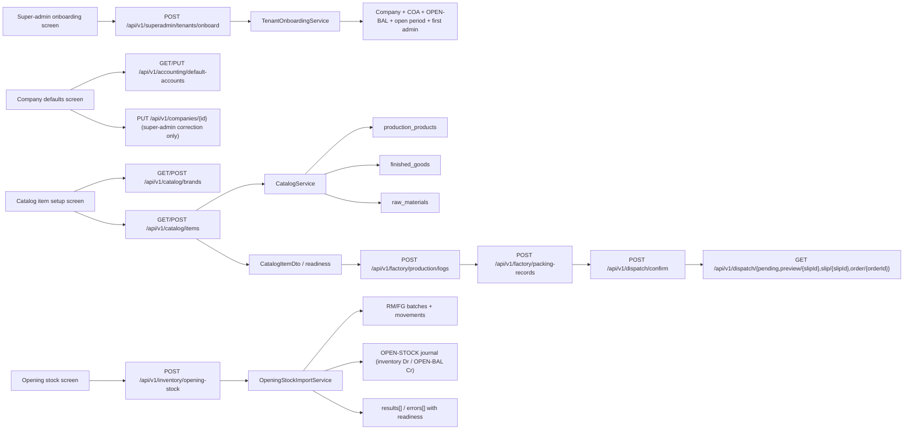

# Current-State Flow

This document records the surviving setup journey after the ERP-38 hard-cut cleanup.

## System Graph

## Step 1: Tenant Bootstrap

### Canonical route

- `POST /api/v1/superadmin/tenants/onboard`

### Owner

- controller: `SuperAdminTenantOnboardingController`
- service: `TenantOnboardingService`

### What it seeds

- `Company`
- chart of accounts from the chosen template
- company default-account pointers
- `OPEN-BAL` equity account
- first tenant admin
- open accounting period
- default system settings

### What it does not seed

- brands
- stock-bearing items
- finished goods
- raw materials
- opening stock

## Step 2: Company Defaults Required For Stock-Bearing Operations

### Canonical routes

- `GET /api/v1/accounting/default-accounts`
- `PUT /api/v1/accounting/default-accounts`

### Owner

- controller: `AccountingController`
- service: `CompanyDefaultAccountsService`

### Super-admin correction path

- `PUT /api/v1/companies/{id}` remains the control-plane path for company metadata corrections such as timezone, state code, and default GST rate

### Operational truth

The setup journey is explicit here. If default inventory, COGS, revenue, tax, or related company metadata are wrong, operators must fix them before item setup or opening stock. Later flows no longer repair missing setup silently.

## Step 3: Stock-Bearing Item Entry

### Canonical routes

- `GET /api/v1/catalog/brands`
- `POST /api/v1/catalog/brands`
- `GET /api/v1/catalog/items`
- `GET /api/v1/catalog/items/{itemId}`
- `POST /api/v1/catalog/items`
- `PUT /api/v1/catalog/items/{itemId}`
- `DELETE /api/v1/catalog/items/{itemId}`

### Owner

- controller: `CatalogController`
- service: `CatalogService`
- import adjunct: `ProductionCatalogService.importCatalog(...)`

### Important truth

Single-item stock-bearing setup now lives on `POST /api/v1/catalog/items`. Retired setup hosts `legacy product routes` and `legacy accounting-prefixed product setup routes` are gone for current-state operator guidance.

### What save guarantees

- canonical item rows are written
- finished-good mirrors are created or updated when required
- raw-material mirrors are created or updated when required
- downstream account metadata is validated or defaulted from company defaults
- readiness can be re-read on canonical item list/detail surfaces

## Step 4: Opening Stock

### Canonical route

- `POST /api/v1/inventory/opening-stock`

### Owner

- controller: `OpeningStockImportController`
- service: `OpeningStockImportService`

### Current contract

- explicit `Idempotency-Key` is required
- explicit `openingStockBatchKey` is required
- only prepared SKUs are accepted
- missing SKU fails fast
- catalog-not-ready SKU fails with `stage=catalog`
- inventory-not-ready SKU fails with `stage=inventory`
- missing `OPEN-BAL` fails fast
- no legacy `X-Idempotency-Key`
- no file-hash fallback
- same `openingStockBatchKey` cannot be applied twice under a fresh `Idempotency-Key`
- no raw-material or finished-good auto-create

## Step 5: Execution Handoff

### Canonical write path

- `POST /api/v1/factory/production/logs` creates the production batch and consumes raw materials
- `POST /api/v1/factory/packing-records` records pack output and consumes packaging materials
- `POST /api/v1/dispatch/confirm` is the only surviving dispatch-confirm write owner

### Read-only operational dispatch views

- `GET /api/v1/dispatch/pending`
- `GET /api/v1/dispatch/preview/{slipId}`
- `GET /api/v1/dispatch/slip/{slipId}`
- `GET /api/v1/dispatch/order/{orderId}`

### Why this matters

The operator no longer has to guess between multiple setup or execution hosts. Item setup, readiness, opening stock, production, packing, and final dispatch now form one explicit story.
