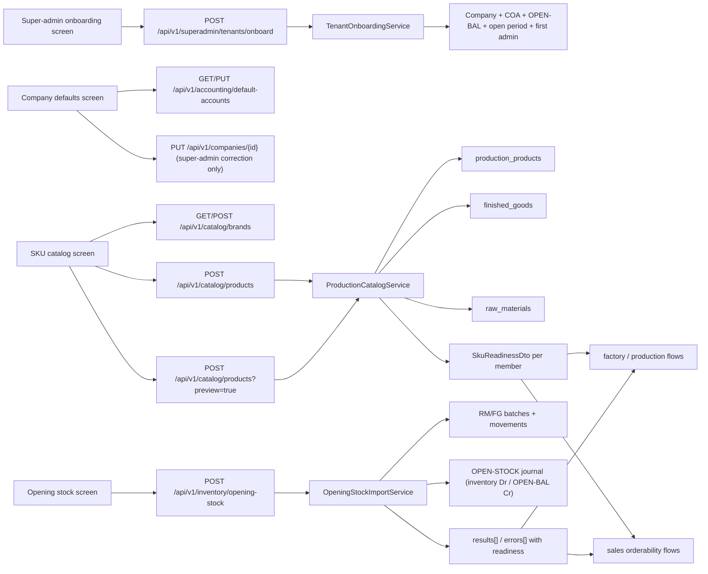

# Current-State Flow

This document records the surviving setup journey after the hard-cut cleanup.

## System Graph

## Step 1: Tenant Bootstrap

### Canonical route

- `POST /api/v1/superadmin/tenants/onboard`

### Owner

- controller: `SuperAdminTenantOnboardingController`
- service: `TenantOnboardingService`

### What it seeds

- `Company`
- chart of accounts from the chosen template
- company default-account pointers
- `OPEN-BAL` equity account
- first tenant admin
- open accounting period
- default system settings

### What it does not seed

- brands
- products
- finished goods
- raw materials
- opening stock

## Step 2: Company Defaults Required For Stock-Bearing Operations

### Canonical routes

- `GET /api/v1/accounting/default-accounts`
- `PUT /api/v1/accounting/default-accounts`

### Owner

- controller: `AccountingController`
- service: `CompanyDefaultAccountsService`

### Super-admin correction path

- `PUT /api/v1/companies/{id}` remains the control-plane path for company
  metadata corrections such as timezone, state code, and default GST rate

### Operational truth

The setup journey is explicit here. If default inventory, COGS, revenue, tax,
or related company metadata are wrong, operators must fix them before SKU setup
or opening stock. Later flows no longer repair missing setup silently.

## Step 3: Stock-Bearing Product Entry

### Canonical routes

- `GET /api/v1/catalog/brands`
- `POST /api/v1/catalog/brands`
- `GET /api/v1/catalog/products`
- `POST /api/v1/catalog/products?preview=true`
- `POST /api/v1/catalog/products`

### Owner

- controller: `CatalogController`
- write engine: `ProductionCatalogService`
- browse/search and brand CRUD: `CatalogService`

### Important truth

Single-SKU and matrix creation now share the same canonical request contract on
`POST /api/v1/catalog/products`. Retired create aliases
`/api/v1/catalog/products/single` and
`/api/v1/catalog/products/bulk-variants` are gone.

### What save guarantees

- `ProductionProduct` rows are written
- finished-good mirrors are created or updated when required
- raw-material mirrors are created or updated when required
- downstream account metadata is validated or defaulted from company defaults
- every returned member includes `SkuReadinessDto`

## Step 4: Opening Stock

### Canonical route

- `POST /api/v1/inventory/opening-stock`

### Owner

- controller: `OpeningStockImportController`
- service: `OpeningStockImportService`

### Current contract

- explicit `Idempotency-Key` is required
- only prepared SKUs are accepted
- missing SKU fails fast
- catalog-not-ready SKU fails with `stage=catalog`
- inventory-not-ready SKU fails with `stage=inventory`
- missing `OPEN-BAL` fails fast
- no legacy `X-Idempotency-Key`
- no file-hash fallback
- no raw-material or finished-good auto-create

### Returned shape

- `results[]` includes `rowNumber`, `sku`, `stockType`, and `readiness`
- `errors[]` includes `rowNumber`, `message`, `sku`, `stockType`, and
  `readiness`

## Step 5: Downstream Readiness

### Canonical readiness surface

- `SkuReadinessDto`

### Stages

- `catalog`
- `inventory`
- `production`
- `sales`

### Why this matters

The operator no longer has to discover setup gaps by jumping between modules.
Catalog entry and opening stock both surface readiness directly, and later
production or sales failures are no longer the first place a missing setup item
appears.
