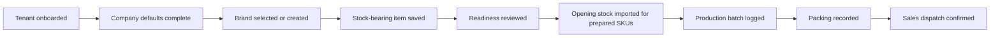

# Target Simplified User Flow

This is the explicit operator journey the current ERP-38 contract now supports.

## Operator Outcome

A new tenant operator should be able to say:

1. the tenant was onboarded
2. stock-bearing defaults were completed
3. brands and stock-bearing items were created from one canonical setup host
4. readiness was reviewed before execution
5. opening stock was loaded only for prepared SKUs
6. production batches, packing records, and sales-owned dispatch confirm follow one operator story

## Screen Ownership

### 1. Tenant bootstrap

- screen owner: super-admin tenant onboarding screen
- required APIs:
  - `GET /api/v1/superadmin/tenants/coa-templates`
  - `POST /api/v1/superadmin/tenants/onboard`
- success means:
  - company exists
  - chart is seeded
  - `OPEN-BAL` exists
  - open period exists
  - first admin exists

### 2. Company-default completion

- screen owner: company defaults/setup screen
- required APIs:
  - `GET /api/v1/accounting/default-accounts`
  - `PUT /api/v1/accounting/default-accounts`
- super-admin correction path when company metadata is wrong:
  - `PUT /api/v1/companies/{id}`

### 3. Stock-bearing item setup

- screen owner: inventory SKU catalog screen
- required APIs:
  - `GET /api/v1/catalog/brands`
  - `POST /api/v1/catalog/brands`
  - `GET /api/v1/catalog/items`
  - `GET /api/v1/catalog/items/{itemId}`
  - `POST /api/v1/catalog/items`
  - `PUT /api/v1/catalog/items/{itemId}`
- UI rules:
  - brand selection and brand creation happen here
  - stock-bearing setup uses one canonical item request contract
  - readiness is visible on the same host before execution
  - no screen may route setup to `legacy product routes` or `legacy accounting-prefixed product setup routes`

### 4. Opening-stock loading

- screen owner: inventory opening-stock screen
- required APIs:
  - `POST /api/v1/inventory/opening-stock`
  - `GET /api/v1/inventory/opening-stock`
- UI rules:
  - `Idempotency-Key` is required, not optional
  - `openingStockBatchKey` is required, not optional
  - only prepared SKUs can be submitted
  - response tables must show both `results[]` and `errors[]`
  - every blocked row must surface returned readiness detail

### 5. Production batch logging

- screen owner: factory production screen
- required API:
  - `POST /api/v1/factory/production/logs`
- UI rules:
  - production logging is the only supported batch-create write
  - raw-material readiness must already be clear before submit

### 6. Packing

- screen owner: factory packing screen
- required APIs:
  - `POST /api/v1/factory/packing-records`
  - `GET /api/v1/factory/unpacked-batches`
  - `GET /api/v1/factory/production-logs/{productionLogId}/packing-history`
- UI rules:
  - `Idempotency-Key` is required
  - `X-Idempotency-Key` and `X-Request-Id` are not supported
  - packaging setup must be active and usable before submit

### 7. Dispatch confirmation

- screen owner: sales dispatch confirmation screen
- required APIs:
  - `POST /api/v1/sales/dispatch/confirm`
  - `GET /api/v1/dispatch/pending`
  - `GET /api/v1/dispatch/preview/{slipId}`
  - `GET /api/v1/dispatch/slip/{slipId}`
  - `GET /api/v1/dispatch/order/{orderId}`
- UI rules:
  - sales owns the final dispatch-confirm write
  - `/api/v1/dispatch/**` stays read-only operational lookup
  - only packed sellable output should reach dispatch confirm

## Readiness States To Show

For every SKU, frontend must show:

- `catalog`
- `inventory`
- `production`
- `sales`

Each state includes:

- `ready`
- `blockers[]`

## Exact Error Conditions Frontend Must Handle

### Opening stock validation failures

- missing explicit idempotency key
- missing explicit `openingStockBatchKey`
- missing SKU in a row
- missing `OPEN-BAL`
- reused `openingStockBatchKey` under a fresh `Idempotency-Key`
- same `Idempotency-Key` reused with a different `openingStockBatchKey`

### Packing validation failures

- missing `Idempotency-Key`
- legacy pack replay headers
- missing, inactive, or unusable Packaging Setup / Rules
- invalid or not-ready size/child-SKU targets

### Dispatch validation failures

- factory actor attempts final dispatch posting
- quantity mismatch or slip status conflict on `POST /api/v1/sales/dispatch/confirm`
- unpacked or non-sellable output reaches dispatch preparation

## UX Direction

## Rules That Must Stay True

- no screen may route stock-bearing setup to retired `legacy product routes` or `legacy accounting-prefixed product setup routes`
- no screen may treat opening stock as a bootstrap or repair tool
- no screen may hide readiness blockers behind later production or sales errors
- no screen may treat `/api/v1/dispatch/**` as a second dispatch-confirm write surface
