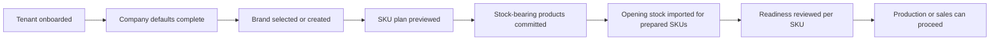

# Target Simplified User Flow

This is the explicit operator journey the current contract now supports.

## Operator Outcome

A new tenant operator should be able to say:

1. the tenant was onboarded
2. stock-bearing defaults were completed
3. brands, products, and variants were created from one SKU setup flow
4. opening stock was loaded only for prepared SKUs
5. readiness is visible immediately per SKU

## Screen Ownership

### 1. Tenant bootstrap

- screen owner: super-admin tenant onboarding screen
- required APIs:
  - `GET /api/v1/superadmin/tenants/coa-templates`
  - `POST /api/v1/superadmin/tenants/onboard`
- success means:
  - company exists
  - chart is seeded
  - `OPEN-BAL` exists
  - open period exists
  - first admin exists

### 2. Company-default completion

- screen owner: company defaults/setup screen
- required APIs:
  - `GET /api/v1/accounting/default-accounts`
  - `PUT /api/v1/accounting/default-accounts`
- super-admin correction path when company metadata is wrong:
  - `PUT /api/v1/companies/{id}`
- UI must make explicit:
  - default inventory account
  - default COGS account
  - default revenue account
  - default discount account
  - default tax account
  - company timezone, state code, and default GST rate when relevant

### 3. Stock-bearing product setup

- screen owner: inventory SKU catalog screen
- required APIs:
  - `GET /api/v1/catalog/brands`
  - `POST /api/v1/catalog/brands`
  - `GET /api/v1/catalog/products`
  - `POST /api/v1/catalog/products?preview=true`
  - `POST /api/v1/catalog/products`
- UI rules:
  - brand selection and brand creation happen here
  - single and matrix creation use one request contract
  - preview and commit use the same payload
  - every returned member must display readiness

### 4. Opening-stock loading

- screen owner: inventory opening-stock screen
- required APIs:
  - `POST /api/v1/inventory/opening-stock`
  - `GET /api/v1/inventory/opening-stock`
- UI rules:
  - `Idempotency-Key` is required, not optional
  - only prepared SKUs can be submitted
  - response tables must show both `results[]` and `errors[]`
  - every blocked row must surface returned readiness detail

## Readiness States To Show

For every SKU, frontend must show:

- `catalog`
- `inventory`
- `production`
- `sales`

Each state includes:

- `ready`
- `blockers[]`

## Exact Error Conditions Frontend Must Handle

### Opening stock validation failures

- missing explicit idempotency key
- missing SKU in a row
- missing `OPEN-BAL`
- `OPEN-BAL` present but not an equity account
- idempotency-key replay conflict with different payload

### Orphan or not-ready SKU failures

The backend returns `stage` and readiness details. Frontend must surface them
without guessing.

- `stage=catalog`
  - `PRODUCT_MASTER_MISSING`
  - `PRODUCT_INACTIVE`
- `stage=inventory`
  - `RAW_MATERIAL_CATEGORY_REQUIRED`
  - `RAW_MATERIAL_MIRROR_MISSING`
  - `RAW_MATERIAL_INVENTORY_ACCOUNT_MISSING`
  - `FINISHED_GOOD_CATEGORY_REQUIRED`
  - `FINISHED_GOOD_MIRROR_MISSING`
  - `FINISHED_GOOD_VALUATION_ACCOUNT_MISSING`
  - `FINISHED_GOOD_COGS_ACCOUNT_MISSING`
  - `FINISHED_GOOD_REVENUE_ACCOUNT_MISSING`
  - `FINISHED_GOOD_TAX_ACCOUNT_MISSING`

### Downstream readiness blockers that still matter after create

- `WIP_ACCOUNT_MISSING`
- `LABOR_APPLIED_ACCOUNT_MISSING`
- `OVERHEAD_APPLIED_ACCOUNT_MISSING`
- `DISCOUNT_ACCOUNT_MISSING`
- `GST_OUTPUT_ACCOUNT_MISSING`
- `FINISHED_GOOD_GST_OUTPUT_ACCOUNT_MISMATCH`
- `NO_FINISHED_GOOD_BATCH_STOCK`
- `RAW_MATERIAL_SKU_NOT_SALES_ORDERABLE`

## UX Direction

## Rules That Must Stay True

- no screen may route product create to retired `/single` or `/bulk-variants`
- no screen may treat opening stock as a bootstrap or repair tool
- no screen may hide readiness blockers behind later production or sales errors
