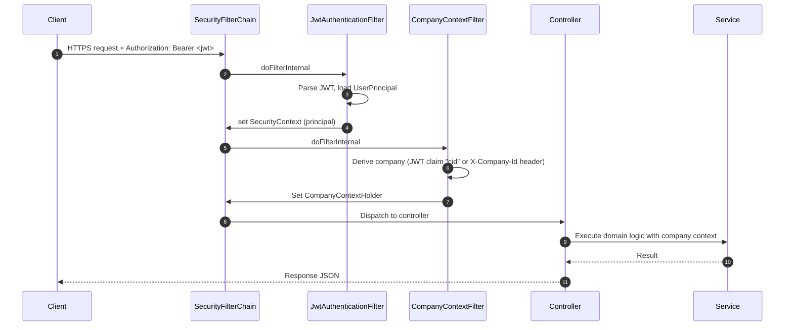
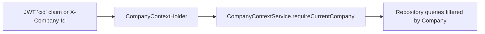
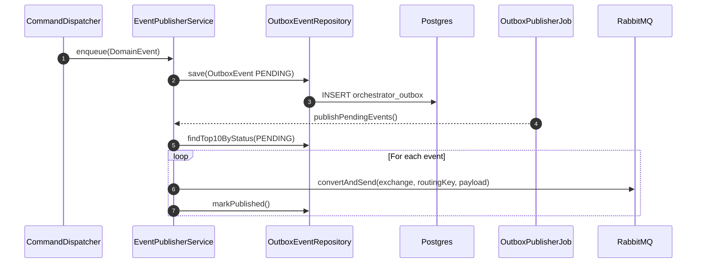
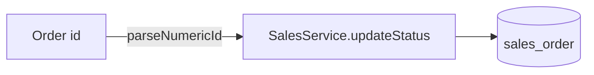
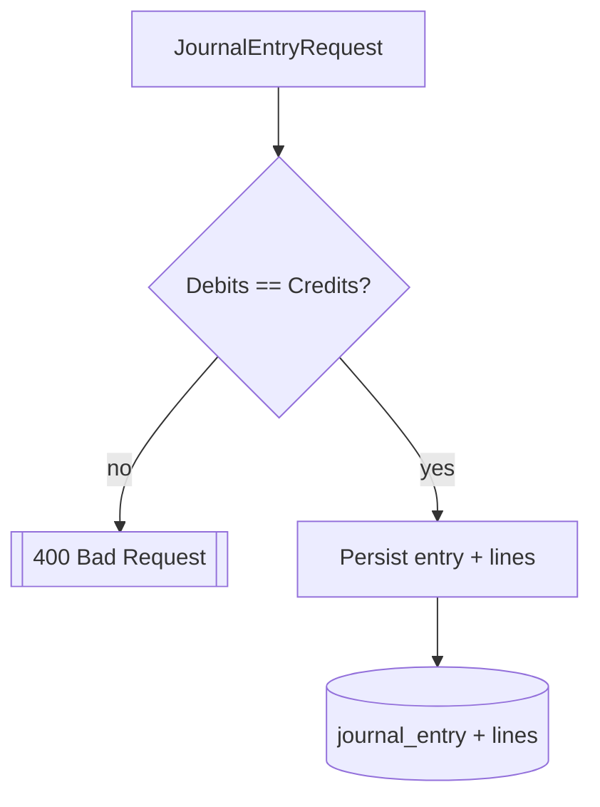
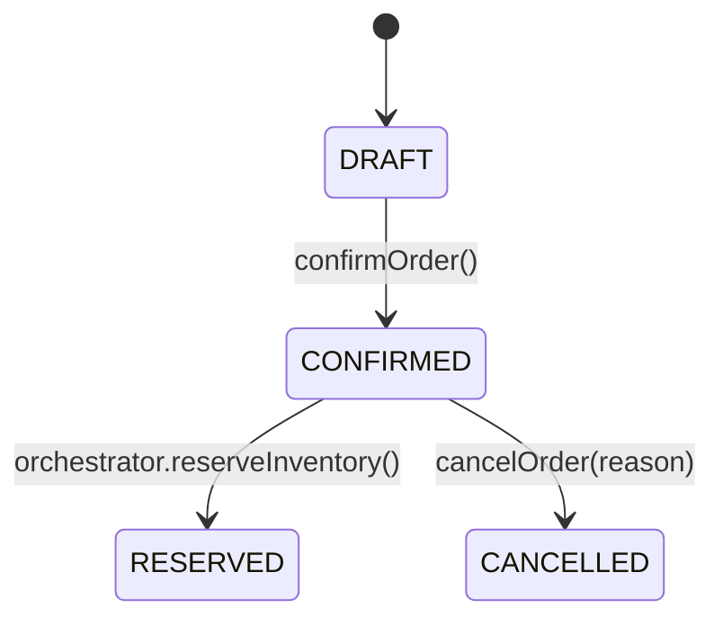
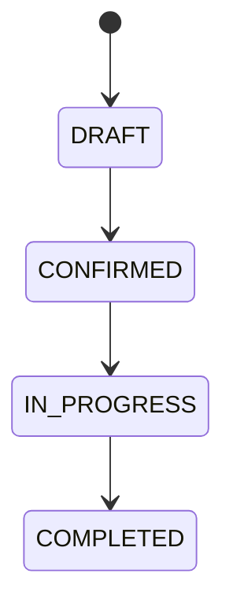

# BigBright ERP – Backend Flowcharts and Deep-Dive

This document provides an end‑to‑end, visual explanation of the backend. It includes flowcharts (Mermaid) for request lifecycle, multi‑tenancy, orchestrated workflows, outbox eventing, scheduler, and concrete input/output examples with persona‑style walkthroughs.

> Tip: GitHub and many IDEs render Mermaid natively. If not, paste the code blocks into a Mermaid live editor.

---

## 1) System Overview (Containers)

```mermaid
flowchart LR
  subgraph Client
    FE[React Frontend]
    Tools[API Clients / Scripts]
  end

  subgraph App[Spring Boot: erp-domain]
    SEC[SecurityConfig\nJWT + Company filters]
    CTRL[REST Controllers]\n--> SVC[Domain Services]
    ORCH[Orchestrator\n(CommandDispatcher, Workflows)]
    TRACE[TraceService\n(AuditRepository)]
    OUTBOX[EventPublisherService\n(OutboxEventRepository)]
    SCHED[SchedulerService\n+ OutboxPublisherJob]
  end

  MQ[(RabbitMQ)]
  DB[(Postgres)]

  FE -->|HTTPS + JWT| SEC
  Tools -->|HTTPS| SEC
  SEC --> CTRL
  CTRL --> SVC
  CTRL --> ORCH
  SVC <--> DB
  ORCH --> TRACE
  ORCH --> OUTBOX
  OUTBOX --> MQ
  SCHED --> OUTBOX
  TRACE <--> DB
  OUTBOX <--> DB
  SCHED <--> DB
```

Key: Controllers accept HTTP, orchestrator coordinates multi‑step flows, services handle module logic, outbox reliably publishes domain events, and scheduler runs automation (like publishing outbox events).

---

## 2) Request Lifecycle & Security



References:
- `erp-domain/src/main/java/com/bigbrightpaints/erp/core/security/SecurityConfig.java:1`
- `erp-domain/src/main/java/com/bigbrightpaints/erp/core/security/JwtAuthenticationFilter.java:1`
- `erp-domain/src/main/java/com/bigbrightpaints/erp/core/security/CompanyContextFilter.java:1`

---

## 3) Multi‑Tenancy Context



References:
- `erp-domain/src/main/java/com/bigbrightpaints/erp/modules/company/service/CompanyContextService.java:1`

---

## 4) Orchestrated Workflows

### 4.1 Order Auto-Approval (Book → Reserve → Dispatch)

Orders no longer wait for manual approval. As soon as a salesperson creates an order, the orchestrator starts the `order-auto-approval` workflow, generates a trace, and coordinates finished-goods reservations, packaging slips, and accounting postings.

```mermaid
flowchart TD
  start([POST /api/v1/sales/orders]) --> A[OrderFulfillmentService\npersist order + items]
  A --> B[EventPublisher\nemit OrderBookedEvent]
  B --> C[CommandDispatcher.autoApproveOrder]
  C --> D[WorkflowService.start("order-auto-approval") -> traceId]
  D --> E[FinishedGoodsService.reserveForOrder\n(FEFO batches + packaging slip)]
  E --> F[AccountingService.postSalesBooking\nDr AR / Cr Sales+Tax]
  F --> G[FinishedGoodsService.markSlipDispatched\nupdate inventory & COGS postings]
  G --> H[TraceService.record("ORDER_AUTO_APPROVED")]
  H --> end((HTTP 201 Created\n{ order, traceId }))
```

Key outputs:
- Order response now includes the generated `traceId`.
- Packaging slip + reservation data is available immediately for warehouse users.
- Inventory movements trigger a COGS journal: `Dr COGS`, `Cr Finished Goods Inventory`.

References:
- `erp-domain/src/main/java/com/bigbrightpaints/erp/modules/sales/service/SalesService.java`
- `erp-domain/src/main/java/com/bigbrightpaints/erp/orchestrator/service/CommandDispatcher.java`
- `erp-domain/src/main/java/com/bigbrightpaints/erp/orchestrator/service/IntegrationCoordinator.java`
- `erp-domain/src/main/java/com/bigbrightpaints/erp/modules/inventory/service/FinishedGoodsService.java`

### 4.2 Factory Dispatch

```mermaid
flowchart TD
  start([POST /orchestrator/factory/dispatch/{batchId}]) --> A[PolicyEnforcer.checkDispatchPermissions]
  A --> B[WorkflowService.start("dispatch") -> traceId]
  B --> C[IntegrationCoordinator.updateProductionStatus(batchId)]
  C --> D[IntegrationCoordinator.releaseInventory(batchId)]
  D --> E[IntegrationCoordinator.postDispatchJournal(batchId)]
  E --> F[EventPublisherService.enqueue(ProductionBatchDispatched)]
  F --> G[TraceService.record("BATCH_DISPATCHED")] 
  G --> end((HTTP 202 Accepted\n{ traceId }))
```

Input/Output:
- Input JSON: `DispatchRequest { batchId, requestedBy }`
- Output JSON: `{ "traceId": "<uuid>" }`

### 4.3 Payroll Run

```mermaid
flowchart TD
  start([POST /orchestrator/payroll/run]) --> A[PolicyEnforcer.checkPayrollPermissions]
  A --> B[WorkflowService.start("payroll") -> traceId]
  B --> C[IntegrationCoordinator.syncEmployees(company)]
  C --> D[IntegrationCoordinator.generatePayroll(date)]
  D --> E[IntegrationCoordinator.postPayrollVouchers(date)]
  E --> F[EventPublisherService.enqueue(PayrollCompleted)]
  F --> G[TraceService.record("PAYROLL_COMPLETED")] 
  G --> end((HTTP 202 Accepted\n{ traceId }))
```

Input/Output:
- Input JSON: `PayrollRunRequest { payrollDate, initiatedBy }`
- Output JSON: `{ "traceId": "<uuid>" }`

Trace retrieval for any workflow:
- `GET /api/v1/orchestrator/traces/{traceId}` returns the event timeline.

---

## 5) Transactional Outbox Pattern



References:
- `erp-domain/src/main/java/com/bigbrightpaints/erp/orchestrator/service/EventPublisherService.java:1`
- `erp-domain/src/main/java/com/bigbrightpaints/erp/orchestrator/scheduler/OutboxPublisherJob.java:1`
- `erp-domain/src/main/java/com/bigbrightpaints/erp/orchestrator/repository/OutboxEvent.java:1`

---

## 6) Scheduler & Automation

```mermaid
flowchart LR
  A[registerJob(jobId, cron, runnable,...)] -->|persist| B[(scheduled_jobs table)]
  A -->|schedule| C[TaskScheduler (cron)]
  C --> D[Run job logic]
  D --> E[markRun(jobId) -> lastRunAt]
```

References:
- `erp-domain/src/main/java/com/bigbrightpaints/erp/orchestrator/scheduler/SchedulerService.java:1`
- `erp-domain/src/main/java/com/bigbrightpaints/erp/orchestrator/config/SchedulerConfig.java:1`

---

## 7) Inputs vs Outputs (Representative)

Auth
```http
POST /api/v1/auth/login
{
  "email": "admin@bbp.dev",
  "password": "ChangeMe123!"
}

200 OK
{
  "accessToken": "<jwt>",
  "refreshToken": "<jwt>",
  "expiresIn": 900
}
```

Order Approval
```http
POST /api/v1/orchestrator/orders/101/approve
X-Company-Id: BBP
Authorization: Bearer <jwt>
{
  "approvedBy": "anita@bbp.dev",
  "totalAmount": 125000.50
}

202 Accepted
{ "traceId": "b9f2a0e1-..." }
```

Trace Lookup
```http
GET /api/v1/orchestrator/traces/b9f2a0e1-...
200 OK
{
  "traceId": "b9f2a0e1-...",
  "events": [
    { "eventType": "ORDER_APPROVED", "timestamp": "...", "details": "..." },
    { "eventType": "OUTBOX_PUBLISHED", "timestamp": "...", "details": "..." }
  ]
}
```

---

## 8) Human‑Like Demo Scenarios

Scenario A: Sales Manager (Anita) books a 500-bucket order
- Context: Company `BBP`, order `101` is created from the sales portal with SKU-level line items (e.g., Sapphire Emulsion 20L × 500).
- Step 1: Anita submits the order form (`POST /api/v1/sales/orders`). The backend stores the order, generates serial `BBP-2025-00042`, and immediately emits `OrderBookedEvent`.
- Step 2: Orchestrator auto-starts `order-auto-approval`, reserves finished goods in FEFO order, and creates a packaging slip for the 300 units in stock while flagging the shortfall for production.
- Step 3: Accounting posts `Dr Accounts Receivable / Cr Sales (+ GST)` using the dealer on the order. The response already contains the `traceId`.
- Step 4: Once the warehouse prints the packaging slip and marks it dispatched, orchestrator finalizes the workflow: inventory is deducted, `Dr COGS / Cr Finished Goods Inventory` is posted, and the trace is updated.
- Step 5: The system issues an invoice (`BBP-INV-2025-00042`), adds it to ChatGPT’s AR ledger, and exposes it via the invoice API / dealer portal.
- Step 5: Anita (or the dealer) opens the workflow viewer via `/traces/{traceId}` to see every step: booking → reservation → packaging → COGS posting.

Scenario B: Factory Supervisor (Bilal) dispatches a completed batch
- Calls `/api/v1/orchestrator/factory/dispatch/PLN-500` with `requestedBy="bilal@bbp.dev"`.
- Orchestrator marks the production plan complete, logs a release batch, posts a dispatch journal, enqueues a dispatch event, and audits the trace.
- Returns `traceId` for later inspection.

Scenario C: HR Lead (Carmen) runs payroll
- Calls `/api/v1/orchestrator/payroll/run` with `{ payrollDate: "2025-07-31", initiatedBy: "carmen@bbp.dev" }`.
- Orchestrator syncs employees, creates a payroll run, posts vouchers, enqueues `PayrollCompletedEvent`, and audits the run.
- Returns `traceId`.

See an end-to-end “500 buckets for ChatGPT” demo with concrete commands in `docs/demo-chatgpt-500-buckets.md`.

---

## 9) Key Findings

- Clear orchestration boundary: `CommandDispatcher` coordinates across sales, factory, accounting, and HR modules.
- Reliability via Outbox: Events are persisted then published by a scheduled job, avoiding lost messages.
- Strong multi‑tenancy: Company context is consistently enforced across services and repositories.
- Security posture: Method‑level `@PreAuthorize` plus JWT‑based principals and granular scopes.
- Operability: Audit traces, health endpoints, and dashboards support observability and UX.

Potential improvements (future):
- Persist workflow instances and transitions (rather than just starting with a generated `traceId`).
- Add idempotency keys for orchestrated commands and compensation steps for partial failures.
- Enrich events with correlation IDs and versioned schemas; add DLQs and retries around RabbitMQ.
- Expose admin APIs for scheduler job management.

---

## 10) Appendix – Module Examples

Sales Status Update (used by orchestration)


Accounting Journal Posting (balance validation)


Sales Order Lifecycle


Factory Plan Lifecycle

