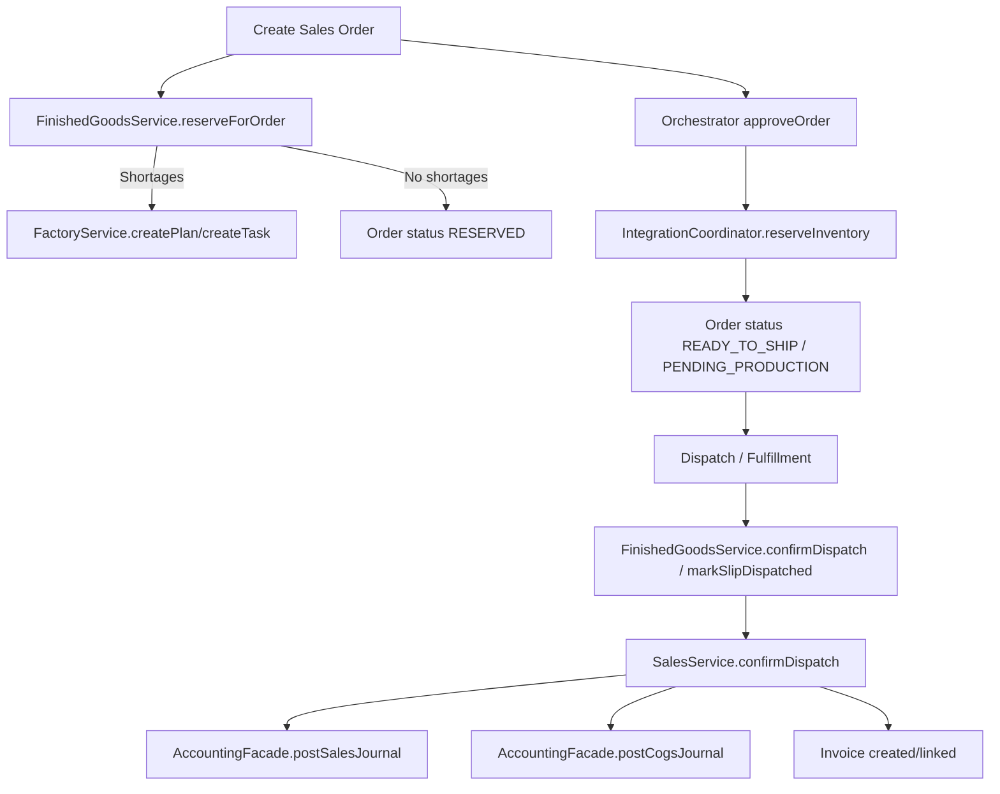

# Internal Release Audit (erp-domain)

## A. Journal Posting Matrix
| Business action | Posting function | Reference / idempotency key | Triggering module or entrypoint |
| --- | --- | --- | --- |
| Sales invoice (order-level) | `SalesJournalService.postSalesJournal` → `AccountingFacade.postSalesJournal` | `SalesOrderReference.invoiceReference(orderNumber)` (canonical `INV-<orderNumber>`) | `InvoiceService.issueInvoiceForOrder` |
| Sales invoice on dispatch | `SalesService.confirmDispatch` → `AccountingFacade.postSalesJournal` | Invoice number (`InvoiceNumberService`), also checks canonical `INV-<orderNumber>` | `SalesService.confirmDispatch` (also via `SalesFulfillmentService`) |
| Sales journal (manual/orchestrator) | `SalesJournalService.postSalesJournal` → `AccountingFacade.postSalesJournal` | Canonical `INV-<orderNumber>` or provided reference | `IntegrationCoordinator.createAccountingEntry`, `SalesFulfillmentService` |
| Sales COGS on dispatch | `AccountingFacade.postCogsJournal` | `COGS-<slipNumber>` | `SalesService.confirmDispatch` |
| Sales COGS on fulfillment | `AccountingFacade.postCogsJournal` | `COGS-<orderNumber>` | `SalesFulfillmentService.postCogsFromDispatches` |
| Sales return (AR/revenue/tax reversal) | `AccountingFacade.postSalesReturn` | `CRN-<invoiceNumber>` | `SalesReturnService.processReturn` |
| Sales return COGS reversal | `AccountingFacade.postInventoryAdjustment` | `CRN-<invoiceNumber>-COGS-<index>` | `SalesReturnService.postCogsReversal` |
| Purchase journal (raw material purchase) | `AccountingFacade.postPurchaseJournal` | `ReferenceNumberService.purchaseReference(company, supplier, invoiceNumber)` or provided | `PurchasingService.createPurchase` |
| Raw material intake receipt | `AccountingFacade.postPurchaseJournal` | `batchCode` (receipt context) | `RawMaterialService.recordReceipt` |
| Purchase return | `AccountingFacade.postPurchaseReturn` | `ReferenceNumberService.purchaseReturnReference` or provided | `PurchasingService.processReturn` |
| Inventory adjustment | `AccountingFacade.postInventoryAdjustment` | Provided `referenceId` or generated `inventoryAdjustmentReference` | `InventoryAdjustmentService` |
| Opening stock import | `AccountingService.createJournalEntry` | `ReferenceNumberService.openingStockReference` | `OpeningStockImportService` |
| Material consumption (WIP) | `AccountingFacade.postMaterialConsumption` | `<productionCode>-RM` | `ProductionLogService` |
| Labor/overhead applied (WIP) | `AccountingFacade.postLaborOverheadApplied` | `<productionCode>-LABOH` | `ProductionLogService` |
| Cost variance allocation | `AccountingFacade.postCostVarianceAllocation` | `CVAR-<batchCode>-<periodKey>` | `CostAllocationService` |
| WIP → FG receipt (packing session) | `AccountingService.createJournalEntry` | `<productionCode>-PACK-<movementId>` | `PackingService.postPackingSessionJournal` |
| Packaging material consumption | `AccountingService.createJournalEntry` | `<packRef>-PACKMAT` | `PackingService.postPackagingMaterialJournal` |
| Manufacturing wastage | `AccountingFacade.postSimpleJournal` | `<productionCode>-WASTE` | `PackingService.postCompletionEntries` |
| Bulk packing (bulk → sized FG) | `AccountingService.createJournalEntry` | `PACK-<bulkBatchCode>-<timestamp>` | `BulkPackingService` |
| Factory dispatch journal | `AccountingFacade.postSimpleJournal` | `DISPATCH-<batchId>` | `IntegrationCoordinator.postDispatchJournal` |
| Dealer receipt | `AccountingService.recordDealerReceipt` | `ReferenceNumberService.dealerReceiptReference` or provided | Accounting controller/service |
| Supplier payment | `AccountingService.recordSupplierPayment` | `ReferenceNumberService.supplierPaymentReference` or provided | Accounting controller/service |
| Payroll payment | `AccountingFacade.recordPayrollPayment` → `AccountingService.recordPayrollPayment` | `PayrollRun` reference (idempotent by run status) | Orchestrator + Accounting |
| Inventory revaluation/movement events | `AccountingService.createJournalEntry` | Event-derived hash reference | `InventoryAccountingEventListener` |
| Manual journal entry | `AccountingService.createJournalEntry` | Provided reference or `nextJournalReference` | `AccountingController.createJournalEntry` |

## B. Duplicate Posting Risks & Fixes
- **Sales invoice vs dispatch AR journal**: `InvoiceService.issueInvoiceForOrder` posted AR using `INV-<orderNumber>` while `SalesService.confirmDispatch` posted using invoice numbers → duplicate AR risk. Fixed by linking fulfillment invoices to orders and slips, validating totals, and skipping new AR posts when an order journal already exists. Also added canonical-reference duplicate detection in `AccountingFacade.postSalesJournal`.
- **Orchestrator double production queue**: `approveOrder` queued production even though `reserveInventory` already scheduled urgent production. Fixed by removing the redundant `queueProduction` call and adding idempotent plan/task creation in `FactoryService`.
- **Production/batch logging replays**: `FactoryService.createPlan` and `logBatch` now return existing entities when plan/batch numbers already exist (idempotent on replay).

## C. Orchestrator Flow Diagram

## D. Module Coupling Overview
- **Sales → Inventory → Accounting**: order reservation/dispatch drives inventory movements, AR/Revenue postings, and COGS journals; invoices and dealer ledgers are updated in the same flow.
- **Purchasing → Inventory → Accounting**: raw material purchases create inventory receipts and AP postings (now including GST input tax lines).
- **Factory/Production → Accounting**: production logs post WIP consumption and applied labor/overhead; packing posts WIP→FG receipts and wastage adjustments.
- **Orchestrator → Sales/Factory/Inventory/Accounting**: approval/reservation, production planning, dispatch and payroll coordination; guarded for idempotent replays.
- **Accounting → Tax/Reports**: GST return and reconciliation use journal lines and ledgers as sources of truth.

## E. Release Blockers Checklist
- [x] AR/AP reconciliation stable
- [x] No duplicate postings on event replay
- [x] GST input + output returns correct
- [x] No negative stock allowed (or explicitly supported)
- [x] Order cancel/rollback rules consistent
- [x] All orchestrator commands idempotent
- [ ] All tests green
